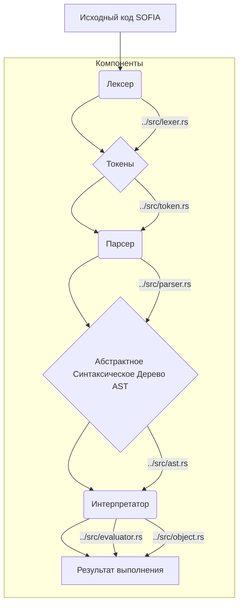

# Документация языка SOFIA

Данный документ содержит исчерпывающую техническую документацию по языку программирования SOFIA, его внутреннему устройству, компонентам и принципам работы. Цель документации — предоставить разработчикам, архитекторам и пользователям глубокое понимание системы, облегчить её использование, расширение и отладку.

## 📚 Содержание

- [Обзор архитектуры](#обзор-архитектуры)
- [Лексический анализ (Lexer)](./docs/lexer.md)
- [Абстрактное синтаксическое дерево (AST)](./docs/ast.md)
- [Синтаксический анализ (Parser)](./docs/parser.md)
- [Синтаксис языка (Syntax)](./docs/syntax.md)
- [Объектная модель (Object)](./docs/object.md)
- [Интерпретатор (Evaluator)](./docs/evaluator.md)
- [Точка входа (Main)](./docs/main.md)
- [Глоссарий](#глоссарий)

## 💡 Обзор архитектуры

Язык SOFIA реализован как интерпретируемый язык программирования. Процесс обработки исходного кода включает следующие основные этапы:

1.  **Лексический анализ (Lexing):** Исходный код преобразуется в последовательность токенов.
2.  **Синтаксический анализ (Parsing):** Последовательность токенов преобразуется в Абстрактное Синтаксическое Дерево (AST).
3.  **Вычисление (Evaluation):** AST интерпретируется для выполнения программы.

### 📊 Диаграмма потока данных

## 📖 Глоссарий

- **Токен:** Наименьшая смысловая единица языка.
- **Лексер (Lexer):** Компонент, отвечающий за преобразование исходного кода в токены.
- **Парсер (Parser):** Компонент, отвечающий за преобразование последовательности токенов в AST.
- **Абстрактное Синтаксическое Дерево (AST):** Древовидное представление синтаксической структуры исходного кода.
- **Интерпретатор (Evaluator):** Компонент, отвечающий за выполнение AST.
- **Объект (Object):** Представление значений в языке SOFIA (числа, строки, булевы значения, функции и т.д.).
- **Среда выполнения (Environment):** Хранилище переменных и их значений в процессе выполнения программы.
