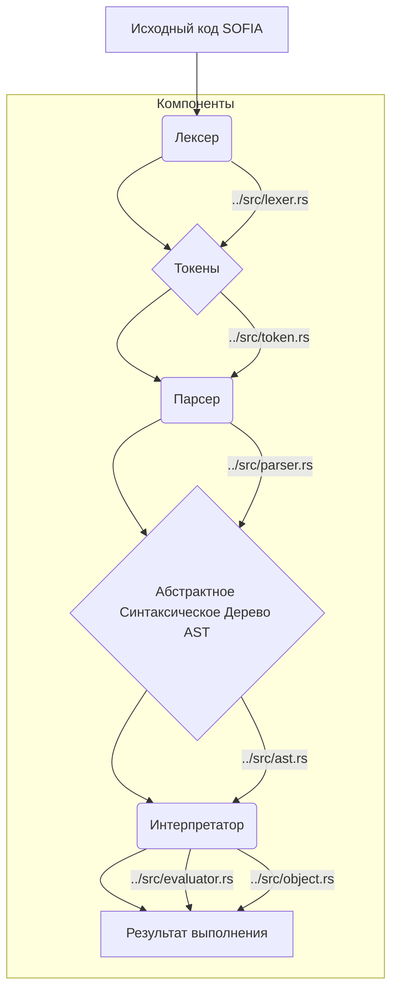
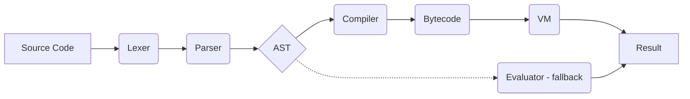

# Документация языка SOFIA

Данный документ содержит исчерпывающую техническую документацию по языку программирования SOFIA, его внутреннему устройству, компонентам и принципам работы. Цель документации — предоставить разработчикам, архитекторам и пользователям глубокое понимание системы, облегчить её использование, расширение и отладку.

## 📚 Содержание

- [Обзор архитектуры](#обзор-архитектуры)
- [Лексический анализ (Lexer)](./docs/lexer.md)
- [Абстрактное синтаксическое дерево (AST)](./docs/ast.md)
- [Синтаксический анализ (Parser)](./docs/parser.md)
- [Синтаксис языка (Syntax)](./docs/syntax.md)
- [Объектная модель (Object)](./docs/object.md)
- [Интерпретатор (Evaluator)](./docs/evaluator.md)
- [Компилятор (Compiler)](./docs/bytecodes.md)
- [Точка входа (Main)](./docs/main.md)
- [Структура проекта](#-структура-проекта)
- [Архитектура](#-архитектура)
- [Модули](#-модули)
- [Статистика](#-статистика)
- [Последние изменения](#-последние-изменения)
- [Глоссарий](#-глоссарий)

## 💡 Обзор архитектуры

Язык SOFIA реализован как интерпретируемый язык программирования. Процесс обработки исходного кода включает следующие основные этапы:

1.  **Лексический анализ (Lexing):** Исходный код преобразуется в последовательность токенов.
2.  **Синтаксический анализ (Parsing):** Последовательность токенов преобразуется в Абстрактное Синтаксическое Дерево (AST).
3.  **Вычисление (Evaluation):** AST интерпретируется для выполнения программы.

### 📊 Диаграмма потока данных


```mermaid
graph TD
    A[Исходный код SOFIA] --> B(Лексер);
    B --> C{Токены};
    C --> D(Парсер);
    D --> E{Абстрактное Синтаксическое Дерево AST};
    E --> F(Интерпретатор);
    F --> G[Результат выполнения];

    subgraph Компоненты
        B -- ../src/lexer.rs --> C;
        D -- ../src/parser.rs --> E;
        F -- ../src/evaluator.rs --> G;
        C -- ../src/token.rs --> D;
        E -- ../src/ast.rs --> F;
        F -- ../src/object.rs --> G;
    end
```

## 📁 Структура проекта

<!-- BEGIN structure -->
```
src/
    ast.rs
        disassembler.rs
        instructions.rs
        mod.rs
        opcode.rs
    compiler.rs
    evaluator.rs
    lexer.rs
    lib.rs
    main.rs
    object.rs
    parser.rs
    token.rs
        mod.rs
```
<!-- END structure -->

## 🏗 Архитектура

<!-- BEGIN architecture -->

```mermaid
graph LR
    A[Source Code] --> B(Lexer)
    B --> C(Parser)
    C --> D{AST}
    D --> E(Compiler)
    E --> F(Bytecode)
    F --> G(VM)
    G --> H[Result]
    D -.-> I(Evaluator - fallback)
    I --> H
```
<!-- END architecture -->

## 📦 Модули

<!-- BEGIN modules -->
| Модуль | Публичные типы | Описание |
|---|---|---|
| `ast` | Program, LetStatement, Identifier, ReturnStatement, ExpressionStatement, BlockStatement, IntegerLiteral, BooleanLiteral, PrefixExpression, InfixExpression, IfExpression, FunctionLiteral, CallExpression, StringLiteral, ArrayLiteral, ClassDeclaration, InterfaceDeclaration, StructDeclaration, PropertyDeclaration, MethodDeclaration, MethodSignatureDeclaration, NewExpression, ThisExpression, SuperExpression, PropertyAccessExpression, MethodCallExpression, MatchExpression, MatchArm, RangePattern, StructPattern, Node, Statement, Expression, AccessModifier, Pattern |  |
| `disassembler` |  |  |
| `instructions` | Instructions |  |
| `mod` |  |  |
| `opcode` | Opcode |  |
| `compiler` | Compiler, CompilerError |  |
| `evaluator` |  |  |
| `lexer` | Lexer |  |
| `lib` |  |  |
| `main` |  |  |
| `object` | Class, ClassInstance, Struct, StructInstance, Interface, Method, MethodSignature, Environment, Object |  |
| `parser` | Parser, ParserError |  |
| `token` | Token, TokenType |  |
| `mod` | VM, CallFrame |  |
<!-- END modules -->

## 📊 Статистика

<!-- BEGIN stats -->
- **Файлов:** 14
- **Модулей:** 12
- **Публичных структур:** 45
- **Публичных enum:** 10
- **Публичных функций:** 2
- **Строк кода:** 7351
- **Модулей с тестами:** 8
<!-- END stats -->

## 🔄 Последние изменения

<!-- BEGIN changes -->
*Автообновлено: 2026-06-11 22:33:33*
*Всего модулей: 12, строк кода: 7351*
<!-- END changes -->

## 📖 Глоссарий

- **Токен:** Наименьшая смысловая единица языка.
- **Лексер (Lexer):** Компонент, отвечающий за преобразование исходного кода в токены.
- **Парсер (Parser):** Компонент, отвечающий за преобразование последовательности токенов в AST.
- **Абстрактное Синтаксическое Дерево (AST):** Древовидное представление синтаксической структуры исходного кода.
- **Интерпретатор (Evaluator):** Компонент, отвечающий за выполнение AST.
- **Объект (Object):** Представление значений в языке SOFIA (числа, строки, булевы значения, функции и т.д.).
- **Среда выполнения (Environment):** Хранилище переменных и их значений в процессе выполнения программы.
