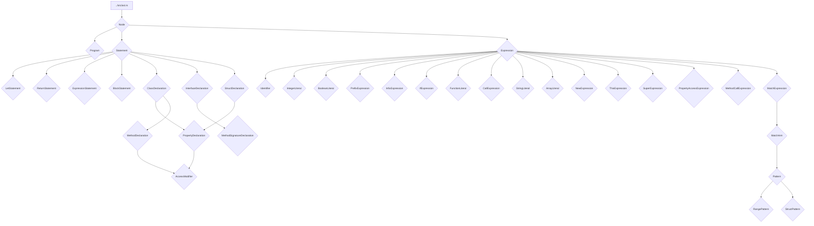

# Абстрактное синтаксическое дерево (../src/ast.rs)

Модуль [`../src/ast.rs`](../src/ast.rs) определяет структуры данных для Абстрактного Синтаксического Дерева (AST) языка SOFIA. AST является центральным представлением исходного кода после этапа синтаксического анализа и используется интерпретатором для выполнения программы. Каждая конструкция языка (оператор, выражение, объявление) представлена соответствующим узлом в дереве.

## 💡 Структура модуля



## 🏷️ Перечисления

### `Node`

Перечисление [`Node`](../src/ast.rs:5) является корневым типом для всех элементов AST, позволяя унифицированно обрабатывать программы, операторы и выражения.

- `Program(Program)`: Представляет всю программу.
- `Statement(Statement)`: Представляет оператор.
- `Expression(Expression)`: Представляет выражение.

### `Statement`

Перечисление [`Statement`](../src/ast.rs:51) определяет различные типы операторов, которые могут быть в языке SOFIA.

- `Let(LetStatement)`: Объявление переменной с использованием `let`.
- `Return(ReturnStatement)`: Оператор возврата значения из функции.
- `Expression(ExpressionStatement)`: Оператор, состоящий из одного выражения.
- `Block(BlockStatement)`: Блок операторов, заключенный в фигурные скобки.
- `ClassDeclaration(ClassDeclaration)`: Объявление класса.
- `InterfaceDeclaration(InterfaceDeclaration)`: Объявление интерфейса.
- `StructDeclaration(StructDeclaration)`: Объявление структуры.

### `Expression`

Перечисление [`Expression`](../src/ast.rs:76) определяет различные типы выражений.

- `Identifier(Identifier)`: Идентификатор (например, имя переменной).
- `IntegerLiteral(IntegerLiteral)`: Целочисленный литерал.
- `Boolean(BooleanLiteral)`: Булевый литерал (`true` или `false`).
- `Prefix(PrefixExpression)`: Префиксное выражение (например, `!x`, `-y`).
- `Infix(InfixExpression)`: Инфиксное выражение (например, `x + y`, `a == b`).
- `If(IfExpression)`: Условное выражение `if`.
- `FunctionLiteral(FunctionLiteral)`: Литерал функции.
- `Call(CallExpression)`: Вызов функции.
- `StringLiteral(StringLiteral)`: Строковый литерал.
- `ArrayLiteral(ArrayLiteral)`: Литерал массива.
- `New(NewExpression)`: Выражение создания нового экземпляра (`new Class()`).
- `This(ThisExpression)`: Выражение `this`.
- `Super(SuperExpression)`: Выражение `super`.
- `PropertyAccess(PropertyAccessExpression)`: Доступ к свойству объекта (например, `obj.property`).
- `MethodCall(MethodCallExpression)`: Вызов метода объекта (например, `obj.method()`).
- `Match(MatchExpression)`: Выражение сопоставления с образцом `match`.

### `AccessModifier`

Перечисление [`AccessModifier`](../src/ast.rs:275) определяет модификаторы доступа для членов классов и структур.

- `Public`: Публичный доступ.
- `Private`: Приватный доступ.

### `Pattern`

Перечисление [`Pattern`](../src/ast.rs:532) определяет различные типы паттернов, используемых в `match` выражениях.

- `Literal(Expression)`: Литеральный паттерн (например, `1`, `"hello"`, `true`).
- `Identifier(Identifier)`: Идентификаторный паттерн (привязывает значение к переменной).
- `Range(RangePattern)`: Диапазонный паттерн (например, `1..5`, `a..=b`).
- `Tuple(Vec<Pattern>)`: Кортежный паттерн (например, `(1, x, "test")`).
- `Struct(StructPattern)`: Структурный паттерн (например, `Point { x: 0, y }`).
- `Wildcard`: Паттерн-заглушка (`_`), который совпадает с любым значением, но не создает привязок.

## 📦 Структуры

### `Program`

Структура [`Program`](../src/ast.rs:22) представляет собой корневой узел AST, содержащий список операторов, составляющих всю программу.

- `statements`: [`Vec<Statement>`](../src/ast.rs:23) — Вектор операторов программы.

### `LetStatement`

Структура [`LetStatement`](../src/ast.rs:122) представляет оператор объявления переменной.

- `token`: [`Token`](../src/ast.rs:123) — Токен `let`.
- `name`: [`Identifier`](../src/ast.rs:124) — Идентификатор имени переменной.
- `value`: [`Expression`](../src/ast.rs:125) — Выражение, значение которого присваивается переменной.

### `Identifier`

Структура [`Identifier`](../src/ast.rs:139) представляет идентификатор.

- `token`: [`Token`](../src/ast.rs:140) — Токен идентификатора.
- `value`: [`String`](../src/ast.rs:141) — Строковое значение идентификатора.

### `ReturnStatement`

Структура [`ReturnStatement`](../src/ast.rs:145) представляет оператор возврата.

- `token`: [`Token`](../src/ast.rs:146) — Токен `return`.
- `return_value`: [`Expression`](../src/ast.rs:147) — Выражение, значение которого возвращается.

### `ExpressionStatement`

Структура [`ExpressionStatement`](../src/ast.rs:157) представляет оператор, состоящий из одного выражения.

- `token`: [`Token`](../src/ast.rs:158) — Токен, начинающий выражение.
- `expression`: [`Expression`](../src/ast.rs:159) — Само выражение.

### `BlockStatement`

Структура [`BlockStatement`](../src/ast.rs:169) представляет блок операторов, заключенный в фигурные скобки.

- `token`: [`Token`](../src/ast.rs:170) — Токен `{`.
- `statements`: [`Vec<Statement>`](../src/ast.rs:171) — Вектор операторов внутри блока.

### `IntegerLiteral`

Структура [`IntegerLiteral`](../src/ast.rs:184) представляет целочисленный литерал.

- `token`: [`Token`](../src/ast.rs:185) — Токен целого числа.
- `value`: [`i64`](../src/ast.rs:186) — Целочисленное значение.

### `BooleanLiteral`

Структура [`BooleanLiteral`](../src/ast.rs:190) представляет булевый литерал.

- `token`: [`Token`](../src/ast.rs:191) — Токен `true` или `false`.
- `value`: [`bool`](../src/ast.rs:192) — Булево значение.

### `PrefixExpression`

Структура [`PrefixExpression`](../src/ast.rs:196) представляет префиксное выражение.

- `token`: [`Token`](../src/ast.rs:197) — Токен оператора (например, `!`, `-`).
- `operator`: [`String`](../src/ast.rs:198) — Строковое представление оператора.
- `right`: [`Box<Expression>`](../src/ast.rs:199) — Выражение, к которому применяется оператор.

### `InfixExpression`

Структура [`InfixExpression`](../src/ast.rs:203) представляет инфиксное выражение.

- `token`: [`Token`](../src/ast.rs:204) — Токен оператора (например, `+`, `==`).
- `left`: [`Box<Expression>`](../src/ast.rs:205) — Левое выражение.
- `operator`: [`String`](../src/ast.rs:206) — Строковое представление оператора.
- `right`: [`Box<Expression>`](../src/ast.rs:207) — Правое выражение.

### `IfExpression`

Структура [`IfExpression`](../src/ast.rs:211) представляет условное выражение `if`.

- `token`: [`Token`](../src/ast.rs:212) — Токен `if`.
- `condition`: [`Box<Expression>`](../src/ast.rs:213) — Условие.
- `consequence`: [`BlockStatement`](../src/ast.rs:214) — Блок операторов, выполняемый при истинном условии.
- `alternative`: [`Option<BlockStatement>`](../src/ast.rs:215) — Опциональный блок `else`.

### `FunctionLiteral`

Структура [`FunctionLiteral`](../src/ast.rs:229) представляет литерал функции.

- `token`: [`Token`](../src/ast.rs:230) — Токен `fn`.
- `parameters`: [`Vec<Identifier>`](../src/ast.rs:231) — Вектор идентификаторов параметров функции.
- `body`: [`BlockStatement`](../src/ast.rs:232) — Тело функции.

### `CallExpression`

Структура [`CallExpression`](../src/ast.rs:249) представляет вызов функции.

- `token`: [`Token`](../src/ast.rs:250) — Токен `(`.
- `function`: [`Box<Expression>`](../src/ast.rs:251) — Выражение, представляющее вызываемую функцию.
- `arguments`: [`Vec<Expression>`](../src/ast.rs:252) — Вектор выражений-аргументов.

### `StringLiteral`

Структура [`StringLiteral`](../src/ast.rs:263) представляет строковый литерал.

- `token`: [`Token`](../src/ast.rs:264) — Токен строки.
- `value`: [`String`](../src/ast.rs:265) — Строковое значение.

### `ArrayLiteral`

Структура [`ArrayLiteral`](../src/ast.rs:269) представляет литерал массива.

- `token`: [`Token`](../src/ast.rs:270) — Токен `[`.
- `elements`: [`Vec<Expression>`](../src/ast.rs:271) — Вектор выражений-элементов массива.

### `ClassDeclaration`

Структура [`ClassDeclaration`](../src/ast.rs:290) представляет объявление класса.

- `token`: [`Token`](../src/ast.rs:291) — Токен `class`.
- `name`: [`Identifier`](../src/ast.rs:292) — Идентификатор имени класса.
- `super_class`: [`Option<Identifier>`](../src/ast.rs:293) — Опциональный идентификатор родительского класса (для наследования).
- `interfaces`: [`Vec<Identifier>`](../src/ast.rs:294) — Вектор идентификаторов реализуемых интерфейсов.
- `properties`: [`Vec<PropertyDeclaration>`](../src/ast.rs:295) — Вектор объявлений свойств класса.
- `methods`: [`Vec<MethodDeclaration>`](../src/ast.rs:296) — Вектор объявлений методов класса.

### `InterfaceDeclaration`

Структура [`InterfaceDeclaration`](../src/ast.rs:323) представляет объявление интерфейса.

- `token`: [`Token`](../src/ast.rs:324) — Токен `interface`.
- `name`: [`Identifier`](../src/ast.rs:325) — Идентификатор имени интерфейса.
- `method_signatures`: [`Vec<MethodSignatureDeclaration>`](../src/ast.rs:326) — Вектор объявлений сигнатур методов интерфейса.

### `StructDeclaration`

Структура [`StructDeclaration`](../src/ast.rs:342) представляет объявление структуры.

- `token`: [`Token`](../src/ast.rs:343) — Токен `struct`.
- `name`: [`Identifier`](../src/ast.rs:344) — Идентификатор имени структуры.
- `properties`: [`Vec<PropertyDeclaration>`](../src/ast.rs:345) — Вектор объявлений свойств структуры.

### `PropertyDeclaration`

Структура [`PropertyDeclaration`](../src/ast.rs:361) представляет объявление свойства в классе или структуре.

- `token`: [`Token`](../src/ast.rs:362) — Токен, начинающий объявление свойства (например, `let`).
- `name`: [`Identifier`](../src/ast.rs:363) — Идентификатор имени свойства.
- `value`: [`Option<Expression>`](../src/ast.rs:364) — Опциональное выражение, представляющее начальное значение свойства.
- `access_modifier`: [`AccessModifier`](../src/ast.rs:365) — Модификатор доступа свойства.
- `is_static`: [`bool`](../src/ast.rs:366) — Флаг, указывающий, является ли свойство статическим.

### `MethodDeclaration`

Структура [`MethodDeclaration`](../src/ast.rs:385) представляет объявление метода в классе.

- `token`: [`Token`](../src/ast.rs:386) — Токен, начинающий объявление метода (например, `fn`).
- `name`: [`Identifier`](../src/ast.rs:387) — Идентификатор имени метода.
- `parameters`: [`Vec<Identifier>`](../src/ast.rs:388) — Вектор идентификаторов параметров метода.
- `body`: [`BlockStatement`](../src/ast.rs:389) — Тело метода.
- `access_modifier`: [`AccessModifier`](../src/ast.rs:390) — Модификатор доступа метода.
- `is_static`: [`bool`](../src/ast.rs:391) — Флаг, указывающий, является ли метод статическим.

### `MethodSignatureDeclaration`

Структура [`MethodSignatureDeclaration`](../src/ast.rs:413) представляет сигнатуру метода в интерфейсе.

- `token`: [`Token`](../src/ast.rs:414) — Токен, начинающий сигнатуру метода (например, `fn`).
- `name`: [`Identifier`](../src/ast.rs:415) — Идентификатор имени метода.
- `parameters`: [`Vec<Identifier>`](../src/ast.rs:416) — Вектор идентификаторов параметров метода.

### `NewExpression`

Структура [`NewExpression`](../src/ast.rs:427) представляет выражение создания нового экземпляра класса или структуры.

- `token`: [`Token`](../src/ast.rs:428) — Токен `new`.
- `class_name`: [`Identifier`](../src/ast.rs:429) — Идентификатор имени класса или структуры.
- `arguments`: [`Vec<Expression>`](../src/ast.rs:430) — Вектор выражений-аргументов, передаваемых конструктору.

### `ThisExpression`

Структура [`ThisExpression`](../src/ast.rs:441) представляет выражение `this`.

- `token`: [`Token`](../src/ast.rs:442) — Токен `this`.

### `SuperExpression`

Структура [`SuperExpression`](../src/ast.rs:452) представляет выражение `super`.

- `token`: [`Token`](../src/ast.rs:453) — Токен `super`.

### `PropertyAccessExpression`

Структура [`PropertyAccessExpression`](../src/ast.rs:463) представляет выражение доступа к свойству объекта.

- `token`: [`Token`](../src/ast.rs:464) — Токен `.` (точка).
- `left`: [`Box<Expression>`](../src/ast.rs:465) — Выражение, представляющее объект.
- `property`: [`Identifier`](../src/ast.rs:466) — Идентификатор имени свойства.

### `MethodCallExpression`

Структура [`MethodCallExpression`](../src/ast.rs:476) представляет вызов метода объекта.

- `token`: [`Token`](../src/ast.rs:477) — Токен `.` (точка).
- `object`: [`Box<Expression>`](../src/ast.rs:478) — Выражение, представляющее объект.
- `method`: [`Identifier`](../src/ast.rs:479) — Идентификатор имени метода.
- `arguments`: [`Vec<Expression>`](../src/ast.rs:480) — Вектор выражений-аргументов, передаваемых методу.

### `MatchExpression`

Структура [`MatchExpression`](../src/ast.rs:498) представляет выражение сопоставления с образцом `match`.

- `token`: [`Token`](../src/ast.rs:499) — Токен `match`.
- `value`: [`Box<Expression>`](../src/ast.rs:500) — Выражение, значение которого сопоставляется.
- `arms`: [`Vec<MatchArm>`](../src/ast.rs:501) — Вектор ветвей `match`.

### `MatchArm`

Структура [`MatchArm`](../src/ast.rs:513) представляет одну ветвь `match` выражения.

- `pattern`: [`Pattern`](../src/ast.rs:514) — Паттерн, с которым сопоставляется значение.
- `guard`: [`Option<Expression>`](../src/ast.rs:515) — Опциональное выражение-гард, которое должно быть истинным для выполнения ветви.
- `consequence`: [`BlockStatement`](../src/ast.rs:516) — Блок операторов, выполняемый при совпадении паттерна и истинном гарде.

### `RangePattern`

Структура [`RangePattern`](../src/ast.rs:559) представляет шаблон диапазона в `match` выражении.

- `start`: [`Box<Expression>`](../src/ast.rs:560) — Начальное выражение диапазона.
- `end`: [`Box<Expression>`](../src/ast.rs:561) — Конечное выражение диапазона.
- `inclusive`: [`bool`](../src/ast.rs:562) — Флаг, указывающий, является ли диапазон включающим (`..=`) или исключающим (`..`) конечную границу.

### `StructPattern`

Структура [`StructPattern`](../src/ast.rs:577) представляет шаблон структуры в `match` выражении.

- `name`: [`Identifier`](../src/ast.rs:578) — Идентификатор имени структуры.
- `fields`: [`Vec<(Identifier, Option<Pattern>)>`](../src/ast.rs:579) — Вектор полей структуры, где каждое поле состоит из идентификатора имени поля и опционального паттерна для его значения.

## 📝 Примеры строкового представления AST

Каждая структура AST реализует трейт `fmt::Display`, что позволяет получить строковое представление узла.

```rust
// Пример LetStatement
let_x_5; // let x = 5;

// Пример IfExpression
if (x < y) { x } else { y }

// Пример FunctionLiteral
fn(x, y) { x + y; }

// Пример CallExpression
add(1, (2 * 3), (4 + 5))

// Пример ClassDeclaration
class MyClass extends BaseClass implements MyInterface {
    public static a = 1;
    private b;
    public methodA(x, y) {
        return x + y;
    }
}

// Пример MatchExpression
match x {
    1 => 10
    y => 20
    _ => 30
}

// Пример RangePattern
1..=5

// Пример StructPattern
Point { x: 0, y }
```
