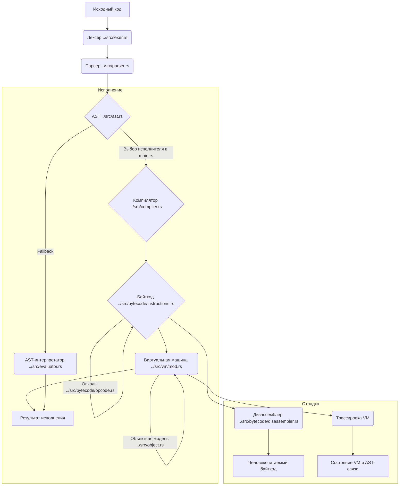

# 🏛️ Система Байткода и VM для SOFIA

### Введение

Данный документ представляет собой архитектурное проектирование системы байткода и регистровой виртуальной машины (VM) для языка SOFIA. Целью является значительное повышение производительности исполнения кода (ориентир X10) при сохранении полной совместимости с существующей семантикой языка и обеспечением расширяемости, отлаживаемости и модульности. Архитектура разработана с учетом требований, и закладывает фундамент для будущих оптимизаций, таких как JIT-компиляция.

### Обзор общей схемы пайплайна

Существующий пайплайн исполнения SOFIA основан на AST-интерпретации. Новая архитектура вводит этап компиляции AST в байткод и его последующее исполнение на регистровой VM.

**Пайплайн исполнения:**

1.  **Исходный код**
2.  **Лексер** ([`../src/lexer.rs`](../src/lexer.rs)): Преобразует исходный код в последовательность токенов.
3.  **Парсер** ([`../src/parser.rs`](../src/parser.rs)): Строит Абстрактное Синтаксическое Дерево (AST) из токенов.
4.  **Компилятор** ([`../src/compiler.rs`](../src/compiler.rs)): Преобразует AST в байткод (`Instructions`).
5.  **Виртуальная машина** ([`../src/vm/mod.rs`](../src/vm/mod.rs)): Исполняет сгенерированный байткод.
6.  **Результат исполнения**

**Механизм выбора исполнителя:**
В точке входа программы ([`../src/main.rs`](../src/main.rs)) будет реализован механизм выбора между AST-интерпретатором и новой VM. По умолчанию будет использоваться VM. AST-интерпретатор ([`../src/evaluator.rs`](../src/evaluator.rs)) сохраняется как референсная реализация и для отладки. Выбор может осуществляться через флаг командной строки (например, `--vm` или `--ast`).



### Детальное описание модулей и их интерфейсов

#### Модуль `../src/bytecode/`

Этот модуль содержит определения для опкодов и структуры, хранящей байткод.

- **`../src/bytecode/mod.rs`**: Точка входа для модуля байткода, экспортирующая `opcode` и `instructions`.

  ```rust
  // ../src/bytecode/mod.rs
  pub mod opcode;
  pub mod instructions;
  ```

- **`../src/bytecode/opcode.rs`**: Определяет перечисление `Opcode` для всех операций VM.

  ```rust
  // ../src/bytecode/opcode.rs
  #[derive(Debug, PartialEq, Clone, Copy)]
  pub enum Opcode {
      // Константы
      Constant, // Загрузить константу из пула констант. Операнд: индекс константы.

      // Арифметические и логические операции
      Add,      // Сложение
      Sub,      // Вычитание
      Mul,      // Умножение
      Div,      // Деление
      Mod,      // Модуль
      Pow,      // Возведение в степень
      Neg,      // Унарный минус
      Not,      // Логическое НЕ
      And,      // Логическое И
      Or,       // Логическое ИЛИ

      // Сравнения
      Equal,    // Равно
      NotEqual, // Не равно
      GreaterThan, // Больше чем
      LessThan, // Меньше чем

      // Управление потоком
      Jump,     // Безусловный переход. Операнд: смещение.
      JumpIfFalse, // Переход, если вершина стека false. Операнд: смещение.
      Call,     // Вызов функции. Операнд: количество аргументов.
      Return,   // Возврат из функции.

      // Работа с переменными
      GetGlobal, // Получить глобальную переменную. Операнд: индекс имени в пуле констант.
      SetGlobal, // Установить глобальную переменную. Операнд: индекс имени в пуле констант.
      GetLocal,  // Получить локальную переменную. Операнд: индекс локальной переменной.
      SetLocal,  // Установить локальную переменную. Операнд: индекс локальной переменной.

      // Работа со структурами данных
      Array,    // Создать массив. Операнд: количество элементов.
      Hash,     // Создать хэш-таблицу (объект). Операнд: количество пар ключ-значение.
      Index,    // Доступ по индексу (для массивов и хэшей).

      // Классы и объекты
      Class,    // Объявить класс. Операнд: индекс имени класса в пуле констант.
      GetProperty, // Получить свойство объекта. Операнд: индекс имени свойства в пуле констант.
      SetProperty, // Установить свойство объекта. Операнд: индекс имени свойства в пуле констант.
      New,      // Создать новый экземпляр класса/структуры. Операнд: количество аргументов конструктора.
      This,     // Загрузить 'this'.
      Super,    // Загрузить 'super'.

      // Специальные
      Pop,      // Удалить значение с вершины стека.
      Null,     // Загрузить null.
      True,     // Загрузить true.
      False,    // Загрузить false.
      NoOp,     // Нет операции (для выравнивания или отладки).
      MapToAst, // Связать текущий опкод с узлом AST (для отладки). Операнд: ID узла AST.
  }

  impl Opcode {
      pub fn to_string(&self) -> &'static str {
          match self {
              Opcode::Constant => "CONSTANT",
              Opcode::Add => "ADD",
              Opcode::Sub => "SUB",
              Opcode::Mul => "MUL",
              Opcode::Div => "DIV",
              Opcode::Mod => "MOD",
              Opcode::Pow => "POW",
              Opcode::Neg => "NEG",
              Opcode::Not => "NOT",
              Opcode::And => "AND",
              Opcode::Or => "OR",
              Opcode::Equal => "EQUAL",
              Opcode::NotEqual => "NOT_EQUAL",
              Opcode::GreaterThan => "GREATER_THAN",
              Opcode::LessThan => "LESS_THAN",
              Opcode::Jump => "JUMP",
              Opcode::JumpIfFalse => "JUMP_IF_FALSE",
              Opcode::Call => "CALL",
              Opcode::Return => "RETURN",
              Opcode::GetGlobal => "GET_GLOBAL",
              Opcode::SetGlobal => "SET_GLOBAL",
              Opcode::GetLocal => "GET_LOCAL",
              Opcode::SetLocal => "SET_LOCAL",
              Opcode::Array => "ARRAY",
              Opcode::Hash => "HASH",
              Opcode::Index => "INDEX",
              Opcode::Class => "CLASS",
              Opcode::GetProperty => "GET_PROPERTY",
              Opcode::SetProperty => "SET_PROPERTY",
              Opcode::New => "NEW",
              Opcode::This => "THIS",
              Opcode::Super => "SUPER",
              Opcode::Pop => "POP",
              Opcode::Null => "NULL",
              Opcode::True => "TRUE",
              Opcode::False => "FALSE",
              Opcode::NoOp => "NO_OP",
              Opcode::MapToAst => "MAP_TO_AST",
          }
      }

      pub fn operand_count(&self) -> usize {
          match self {
              Opcode::Constant
              | Opcode::Jump
              | Opcode::JumpIfFalse
              | Opcode::Call
              | Opcode::GetGlobal
              | Opcode::SetGlobal
              | Opcode::GetLocal
              | Opcode::SetLocal
              | Opcode::Array
              | Opcode::Hash
              | Opcode::Class
              | Opcode::GetProperty
              | Opcode::SetProperty
              | Opcode::New
              | Opcode::MapToAst => 1,
              Opcode::Add | Opcode::Sub | Opcode::Mul | Opcode::Div | Opcode::Mod | Opcode::Pow
              | Opcode::Equal | Opcode::NotEqual | Opcode::GreaterThan | Opcode::LessThan
              | Opcode::And | Opcode::Or
              | Opcode::Index => 0,
              Opcode::Neg | Opcode::Not | Opcode::Return | Opcode::Pop | Opcode::Null
              | Opcode::True | Opcode::False | Opcode::This | Opcode::Super | Opcode::NoOp => 0,
          }
      }
  }
  ```

- **`../src/bytecode/instructions.rs`**: Контейнер для последовательности байткода и пула констант.

  ```rust
  // ../src/bytecode/instructions.rs
  use crate::object::Object;
  use crate::bytecode::opcode::Opcode;

  #[derive(Debug, PartialEq, Clone)]
  pub struct Instructions {
      pub bytes: Vec<u8>,
      pub constants: Vec<Object>, // Пул констант
  }

  impl Instructions {
      pub fn new() -> Self {
          Instructions {
              bytes: Vec::new(),
              constants: Vec::new(),
          }
      }

      pub fn emit(&mut self, op: Opcode, operands: &[usize]) -> usize {
          let pos = self.bytes.len();
          self.bytes.push(op as u8);

          for &operand in operands {
              if operand > u8::MAX as usize {
                  self.bytes.push((operand >> 8) as u8);
                  self.bytes.push(operand as u8);
              } else {
                  self.bytes.push(operand as u8);
              }
          }
          pos
      }

      pub fn add_constant(&mut self, obj: Object) -> usize {
          self.constants.push(obj);
          self.constants.len() - 1
      }

      pub fn get_opcode(&self, offset: usize) -> Option<Opcode> {
          if offset < self.bytes.len() {
              Some(unsafe { std::mem::transmute::<u8, Opcode>(self.bytes[offset]) })
          } else {
              None
          }
      }

      pub fn get_operand(&self, offset: usize, size: usize) -> Option<usize> {
          if offset + size <= self.bytes.len() {
              let mut operand = 0;
              for i in 0..size {
                  operand = (operand << 8) | (self.bytes[offset + i] as usize);
              }
              Some(operand)
          } else {
              None
          }
      }
  }
  ```

#### Модуль `../src/vm/`

Этот модуль содержит реализацию регистровой виртуальной машины.

- **`../src/vm/mod.rs`**: Основная структура VM и вспомогательные типы.

  ```rust
  // ../src/vm/mod.rs
  use crate::bytecode::instructions::Instructions;
  use crate::object::Object;
  use std::collections::HashMap;
  use std::rc::Rc;
  use std::cell::RefCell;

  const STACK_SIZE: usize = 2048;
  const NUM_REGISTERS: usize = 16;

  pub struct VM {
      pub instructions: Instructions,
      pub stack: Vec<Object>,
      pub sp: usize,
      pub registers: Vec<Object>,
      pub ip: usize,
      pub frames: Vec<CallFrame>,
      pub globals: Rc<RefCell<HashMap<String, Object>>>,
      pub current_frame_index: usize,
  }

  impl VM {
      pub fn new(instructions: Instructions) -> Self {
          VM {
              instructions,
              stack: vec![Object::Null; STACK_SIZE],
              sp: 0,
              registers: vec![Object::Null; NUM_REGISTERS],
              ip: 0,
              frames: Vec::new(),
              globals: Rc::new(RefCell::new(HashMap::new())),
              current_frame_index: 0,
          }
      }

      pub fn run(&mut self) -> Result<Object, String> {
          // Здесь будет основная логика цикла выполнения байткода
          // ...
          Ok(Object::Null)
      }

      fn push(&mut self, obj: Object) -> Result<(), String> {
          if self.sp >= STACK_SIZE {
              return Err("Stack overflow".to_string());
          }
          self.stack.insert(self.sp, obj);
          self.sp += 1;
          Ok(())
      }

      fn pop(&mut self) -> Result<Object, String> {
          if self.sp == 0 {
              return Err("Stack underflow".to_string());
          }
          self.sp -= 1;
          Ok(self.stack.remove(self.sp))
      }
  }

  #[derive(Debug, PartialEq, Clone)]
  pub struct CallFrame {
      // pub function: Rc<CompiledFunction>,
      pub return_addr: usize,
      pub base_pointer: usize,
      pub num_locals: usize,
      // pub registers_snapshot: Vec<Object>,
  }

  #[derive(Debug, PartialEq, Clone)]
  pub struct CompiledFunction {
      pub instructions_offset: usize,
      pub num_locals: usize,
      pub num_parameters: usize,
  }
  ```

#### Модуль `../src/compiler.rs`

Этот модуль отвечает за трансляцию AST в байткод.

- **`../src/compiler.rs`**:

  ```rust
  // ../src/compiler.rs
  use crate::ast::{Program, Statement, Expression};
  use crate::bytecode::instructions::Instructions;
  use crate::bytecode::opcode::Opcode;
  use crate::object::Object;

  #[derive(Debug)]
  pub enum CompilerError {
      UnknownOperator(String),
      // ... другие ошибки компиляции
  }

  pub struct Compiler {
      instructions: Instructions,
      // ... таблицы символов, счетчики для локальных переменных
  }

  impl Compiler {
      pub fn new() -> Self {
          Compiler {
              instructions: Instructions::new(),
          }
      }

      pub fn compile_program(&mut self, program: Program) -> Result<Instructions, CompilerError> {
          for statement in program.statements {
              self.compile_statement(statement)?;
          }
          Ok(std::mem::take(&mut self.instructions))
      }

      fn compile_statement(&mut self, statement: Statement) -> Result<(), CompilerError> {
          match statement {
              Statement::Expression(expr_stmt) => {
                  self.compile_expression(expr_stmt.expression)?;
                  self.instructions.emit(Opcode::Pop, &[]);
              },
              Statement::Let(let_stmt) => {
                  self.compile_expression(let_stmt.value)?;
                  self.instructions.emit(Opcode::SetGlobal, &[0]);
              },
              Statement::Return(ret_stmt) => {
                  self.compile_expression(ret_stmt.return_value)?;
                  self.instructions.emit(Opcode::Return, &[]);
              },
              // ... другие типы операторов
              _ => unimplemented!(),
          }
          Ok(())
      }

      fn compile_expression(&mut self, expression: Expression) -> Result<(), CompilerError> {
          match expression {
              Expression::IntegerLiteral(il) => {
                  let constant_index = self.instructions.add_constant(Object::Integer(il.value));
                  self.instructions.emit(Opcode::Constant, &[constant_index]);
              },
              Expression::Boolean(b) => {
                  if b.value {
                      self.instructions.emit(Opcode::True, &[]);
                  } else {
                      self.instructions.emit(Opcode::False, &[]);
                  }
              },
              Expression::Prefix(pe) => {
                  self.compile_expression(*pe.right)?;
                  match pe.operator.as_str() {
                      "!" => self.instructions.emit(Opcode::Not, &[]),
                      "-" => self.instructions.emit(Opcode::Neg, &[]),
                      _ => return Err(CompilerError::UnknownOperator(pe.operator)),
                  };
              },
              Expression::Infix(ie) => {
                  self.compile_expression(*ie.left)?;
                  self.compile_expression(*ie.right)?;
                  match ie.operator.as_str() {
                      "+" => self.instructions.emit(Opcode::Add, &[]),
                      "-" => self.instructions.emit(Opcode::Sub, &[]),
                      "*" => self.instructions.emit(Opcode::Mul, &[]),
                      "/" => self.instructions.emit(Opcode::Div, &[]),
                      "%" => self.instructions.emit(Opcode::Mod, &[]),
                      "**" => self.instructions.emit(Opcode::Pow, &[]),
                      "==" => self.instructions.emit(Opcode::Equal, &[]),
                      "!=" => self.instructions.emit(Opcode::NotEqual, &[]),
                      ">" => self.instructions.emit(Opcode::GreaterThan, &[]),
                      "<" => self.instructions.emit(Opcode::LessThan, &[]),
                      "&&" => self.instructions.emit(Opcode::And, &[]),
                      "||" => self.instructions.emit(Opcode::Or, &[]),
                      _ => return Err(CompilerError::UnknownOperator(ie.operator)),
                  };
              },
              // ... другие типы выражений
              _ => unimplemented!(),
          }
          Ok(())
      }
  }
  ```

#### Модуль `../src/bytecode/disassembler.rs`

Этот модуль предоставляет функциональность для преобразования байткода в человекочитаемый формат.

- **`../src/bytecode/disassembler.rs`**:

  ```rust
  // ../src/bytecode/disassembler.rs
  use crate::bytecode::instructions::Instructions;
  use crate::bytecode::opcode::Opcode;

  pub fn disassemble(instructions: &Instructions) -> String {
      let mut output = String::new();
      let mut offset = 0;
      while offset < instructions.bytes.len() {
          let op = instructions.get_opcode(offset).expect("Invalid opcode");
          output.push_str(&format!("{:04} {}\n", offset, op.to_string()));
          offset += 1;

          let operand_count = op.operand_count();
          for i in 0..operand_count {
              let operand_value = instructions.get_operand(offset, 1).expect("Missing operand");
              output.push_str(&format!("       Operand {}: {}\n", i, operand_value));
              offset += 1;
          }
      }
      output
  }
  ```

### Перечень опкодов с кратким описанием назначения

Полный список опкодов и их назначение определены в [`../src/bytecode/opcode.rs`](../src/bytecode/opcode.rs). Они покрывают:

- **Константы:** `Constant`
- **Арифметические и логические операции:** `Add`, `Sub`, `Mul`, `Div`, `Mod`, `Pow`, `Neg`, `Not`, `And`, `Or`
- **Сравнения:** `Equal`, `NotEqual`, `GreaterThan`, `LessThan`
- **Управление потоком:** `Jump`, `JumpIfFalse`, `Call`, `Return`
- **Работа с переменными:** `GetGlobal`, `SetGlobal`, `GetLocal`, `SetLocal`
- **Работа со структурами данных:** `Array`, `Hash`, `Index`
- **Классы и объекты:** `Class`, `GetProperty`, `SetProperty`, `New`, `This`, `Super`
- **Специальные:** `Pop`, `Null`, `True`, `False`, `NoOp`, `MapToAst`

### Описание стратегии компиляции AST → bytecode

Компилятор (`../src/compiler.rs`) будет выполнять обход AST, генерируя последовательность байткода.

- **Выражения:**
  - Литералы: помещаются в пул констант, генерируется `Constant`.
  - Идентификаторы: `GetGlobal`/`GetLocal`.
  - Префиксные/инфиксные: компиляция операндов, затем соответствующий опкод.
  - Вызовы функций: компиляция функции и аргументов, затем `Call`.
  - Создание экземпляров: компиляция аргументов, затем `New`.
  - Доступ к свойствам: компиляция объекта, затем `GetProperty`.
  - `this`, `super`: соответствующие опкоды.
- **Операторы:**
  - `LetStatement`: компиляция значения, затем `SetGlobal`/`SetLocal`.
  - `ReturnStatement`: компиляция значения, затем `Return`.
  - `ExpressionStatement`: компиляция выражения, затем `Pop`.
  - `BlockStatement`: последовательная компиляция операторов.
- **Функции и замыкания:**
  - Тело функции компилируется в отдельный блок байткода.
  - Параметры и локальные переменные управляются через фреймы вызова.
  - Замыкания требуют анализа свободных переменных и их захвата.
- **Классы, методы, свойства:**
  - Классы компилируются в объекты `Class` с метаданными.
  - Свойства инициализируются, методы компилируются в `CompiledFunction`.
  - Доступ к членам через `GetProperty`/`SetProperty`.
- **`match`, `if/else`:**
  - Используются опкоды условных и безусловных переходов (`Jump`, `JumpIfFalse`) для управления потоком.
  - `match` требует сложной логики для сопоставления паттернов и обработки гардов.

**Соответствие семантике:** Компилятор будет строго следовать правилам языка SOFIA, определенным в `docs/*.md` и поведением [`../src/evaluator.rs`](../src/evaluator.rs), чтобы гарантировать идентичную семантику.

### Диагностика и отладка

- **Дизассемблер:** Модуль [`../src/bytecode/disassembler.rs`](../src/bytecode/disassembler.rs) предоставляет функцию `disassemble`, которая преобразует `Instructions` в читаемый текстовый формат, отображая опкоды, их операнды и значения констант.
- **Пошаговая трассировка:** VM будет поддерживать "режим отладки" (`debug_mode`), в котором перед выполнением каждой инструкции будет выводиться текущее состояние VM (IP, текущий опкод, стек, регистры, фреймы).
- **Трассируемость opcodes ↔ AST-узлы:** Опкод `MapToAst` будет вставляться компилятором в байткод, связывая конкретную инструкцию с соответствующим узлом AST. Это позволит отладчику отображать исходный код, соответствующий текущей инструкции VM.

### Расширяемость под JIT

- **Байткод как IR:** `Opcode` и `Instructions` являются чистым промежуточным представлением, независимым от исполнителя.
- **Стабильный формат:** Формат байткода будет поддерживаться стабильным, что позволит JIT-компилятору надежно его обрабатывать.
- **Метаданные:** Байткод может быть расширен для включения метаданных о типах и областях видимости, необходимых для JIT-оптимизаций.
- **Хуки:** VM может быть расширена для проверки наличия JIT-скомпилированных версий функций и передачи управления им.
- **Модульность:** JIT-компилятор будет отдельным модулем, взаимодействующим с `Instructions` и VM через четко определенные интерфейсы.

### Матрица трассируемости

- **Требование: Модель исполнения - Регистровая виртуальная машина (VM).**
  - **Элемент архитектуры:** Модуль [`../src/vm/mod.rs`](../src/vm/mod.rs) (структура VM с регистрами, IP, FP, стеком вызовов), [`../src/bytecode/opcode.rs`](../src/bytecode/opcode.rs) (опкоды для регистровой модели).
- **Требование: Объем миграции - Весь язык.**
  - **Элемент архитектуры:** Полный набор опкодов в [`../src/bytecode/opcode.rs`](../src/bytecode/opcode.rs), [`../src/compiler.rs`](../src/compiler.rs) (логика трансляции всех конструкций), принципы трансляции (шаги 16-20).
- **Требование: AST-интерпретатор - Сохранить как fallback.**
  - **Элемент архитектуры:** Механизм выбора в [`../src/main.rs`](../src/main.rs), сохранение [`../src/evaluator.rs`](../src/evaluator.rs).
- **Требование: Совместимость - Абсолютное соответствие семантики, детерминированность.**
  - **Элемент архитектуры:** Принципы трансляции (шаги 16-20), механизм детерминированного исполнения VM (шаг 15), [`../src/compiler.rs`](../src/compiler.rs) (воспроизведение поведения AST).
- **Требование: Производительность - Цель X10.**
  - **Элемент архитектуры:** Использование байткода и VM, регистровый формат VM, расширяемость под JIT (шаг 24).
- **Требование: Отладка - Дизассемблер, пошаговый режим, трассируемость opcodes ↔ AST-узлы.**
  - **Элемент архитектуры:** [`../src/bytecode/disassembler.rs`](../src/bytecode/disassembler.rs) (шаг 22), архитектура пошаговой трассировки VM (шаг 23), опкод `MapToAst`.
- **Требование: Архитектурная форма - Отдельные модули `bytecode/`, `vm/`, расширяемость под JIT.**
  - **Элемент архитектуры:** Структура модулей (шаги 3, 5, 6, 7), абстракции для JIT (шаг 24), четкое выделение слоев (шаг 25).
- **Требование: MVP - Поддержка всего языка.**
  - **Элемент архитектуры:** Полное покрытие языка опкодами (шаг 11) и принципами трансляции (шаги 16-20)
