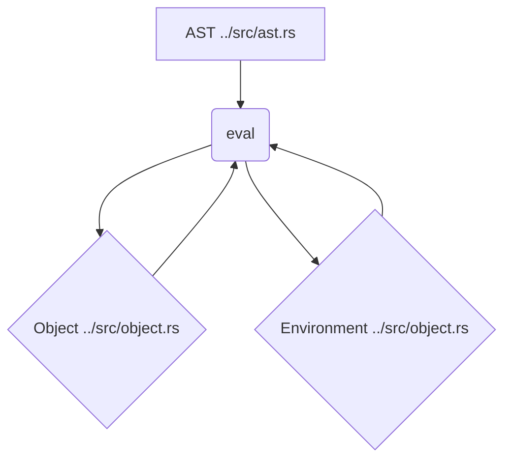

# Интерпретатор (../src/evaluator.rs)

Модуль [`../src/evaluator.rs`](../src/evaluator.rs) реализует интерпретатор (вычислитель) для языка SOFIA. Он отвечает за обход Абстрактного Синтаксического Дерева (AST), построенного парсером, и вычисление значений выражений и операторов. Интерпретатор работает с объектной моделью языка, определенной в модуле [`../src/object.rs`](../src/object.rs), и использует среду выполнения для хранения и разрешения переменных.

## 💡 Структура модуля



## 🛠️ Основные функции

### `eval`

```rust
pub fn eval(node: Node, env: Rc<RefCell<Environment>>) -> Object
```

Главная функция интерпретатора, которая начинает процесс вычисления. Она принимает любой узел AST (`Node`) и среду выполнения (`Environment`), возвращая результат вычисления в виде объекта (`Object`).

- **Параметры:**

  - `node`: [`Node`](../src/ast.rs:5) — Узел AST, который необходимо вычислить (может быть `Program`, `Statement` или `Expression`).
  - `env`: [`Rc<RefCell<Environment>>`](../src/object.rs:155) — Ссылка на текущую среду выполнения.

- **Возвращает:**
  - [`Object`](../src/object.rs:8) — Результат вычисления узла AST.

## 🔒 Вспомогательные функции вычисления

Модуль содержит ряд приватных функций, каждая из которых отвечает за вычисление определенного типа узла AST или операции.

- `eval_program(program: Program, env: Rc<RefCell<Environment>>) -> Object`: Вычисляет последовательность операторов в программе. Обрабатывает операторы возврата и ошибки.
- `eval_statement(statement: Statement, env: Rc<RefCell<Environment>>) -> Object`: Вычисляет отдельный оператор. Делегирует вычисление конкретным функциям в зависимости от типа оператора (например, `let`, `return`, `expression`, `block`, `class`, `struct`, `interface`).
- `eval_class_declaration(class_decl: ClassDeclaration, env: Rc<RefCell<Environment>>) -> Object`: Вычисляет объявление класса, создавая объект [`Class`](../src/object.rs:107) и сохраняя его в среде. Обрабатывает наследование (`extends`) и инициализацию свойств и методов.
- `eval_struct_declaration(struct_decl: StructDeclaration, env: Rc<RefCell<Environment>>) -> Object`: Вычисляет объявление структуры, создавая объект [`Struct`](../src/object.rs:122) и сохраняя его в среде.
- `eval_interface_declaration(interface_decl: InterfaceDeclaration, env: Rc<RefCell<Environment>>) -> Object`: Вычисляет объявление интерфейса, создавая объект [`Interface`](../src/object.rs:134) и сохраняя его в среде.
- `eval_expression(expression: Expression, env: Rc<RefCell<Environment>>) -> Object`: Вычисляет выражение. Делегирует вычисление конкретным функциям в зависимости от типа выражения (например, литералы, префиксные/инфиксные операции, `if`, `function`, `call`, `new`, `this`, `super`, `property access`, `method call`, `match`).
- `eval_block_statement(block: BlockStatement, env: Rc<RefCell<Environment>>) -> Object`: Вычисляет блок операторов, обрабатывая операторы возврата и ошибки.
- `eval_prefix_expression(operator: &str, right: Object) -> Object`: Вычисляет префиксные выражения (`!` и `-`).
- `eval_bang_operator_expression(right: Object) -> Object`: Вычисляет оператор логического отрицания `!`.
- `eval_minus_prefix_operator_expression(right: Object) -> Object`: Вычисляет унарный минус `-`.
- `eval_infix_expression(operator: &str, left: Object, right: Object) -> Object`: Вычисляет инфиксные выражения для различных типов (целые числа, булевы значения, строки, экземпляры классов/структур).
- `eval_integer_infix_expression(operator: &str, left: i64, right: i64) -> Object`: Вычисляет инфиксные операции для целых чисел (`+`, `-`, `*`, `/`, `**`, `%`, `<`, `>`, `==`, `!=`). Включает проверку деления и модуля на ноль, а также отрицательных степеней.
- `eval_boolean_infix_expression(operator: &str, left: bool, right: bool) -> Object`: Вычисляет инфиксные операции для булевых значений (`==`, `!=`, `&&`, `||`).
- `eval_string_infix_expression(operator: &str, left: &str, right: &str) -> Object`: Вычисляет инфиксные операции для строк (`+` для конкатенации).
- `eval_string_integer_infix_expression(operator: &str, left: &str, right: i64) -> Object`: Вычисляет операцию умножения строки на целое число (`*` для повторения строки).
- `eval_if_expression(ie: IfExpression, env: Rc<RefCell<Environment>>) -> Object`: Вычисляет условное выражение `if-else`.
- `is_truthy(obj: Object) -> bool`: Определяет "истинность" объекта (например, `null` и `false` являются ложными).
- `eval_identifier(ident: Identifier, env: Rc<RefCell<Environment>>) -> Object`: Разрешает идентификатор, получая его значение из среды выполнения.
- `eval_expressions(exps: Vec<Expression>, env: Rc<RefCell<Environment>>) -> Vec<Object>`: Вычисляет список выражений.
- `apply_function(func: Object, args: Vec<Object>) -> Object`: Применяет функцию или метод к заданным аргументам. Создает расширенную среду для выполнения тела функции/метода.
- `extend_function_env(params: &[Identifier], args: Vec<Object>, env: &Rc<RefCell<Environment>>) -> Rc<RefCell<Environment>>`: Расширяет среду выполнения для функции, привязывая аргументы к параметрам.
- `unwrap_return_value(obj: Object) -> Object`: Извлекает значение из объекта `ReturnValue`.
- `eval_new_expression(new_expr: NewExpression, env: Rc<RefCell<Environment>>) -> Object`: Вычисляет выражение `new`, создавая новый экземпляр класса или структуры.
- `eval_property_access_expression(pae: PropertyAccessExpression, env: Rc<RefCell<Environment>>) -> Object`: Вычисляет доступ к свойству объекта или структуры.
- `eval_this_expression(_this_expr: ThisExpression, env: Rc<RefCell<Environment>>) -> Object`: Вычисляет выражение `this`, возвращая текущий экземпляр.
- `eval_method_call_expression(mce: MethodCallExpression, env: Rc<RefCell<Environment>>) -> Object`: Вычисляет вызов метода объекта.
- `find_method_in_class(class_rc: Rc<RefCell<Class>>, method_name: &str) -> Option<Rc<RefCell<Method>>>`: Рекурсивно ищет метод в классе и его родительских классах.
- `eval_match_expression(match_expr: crate::ast::MatchExpression, env: Rc<RefCell<Environment>>) -> Object`: Вычисляет выражение `match`, сопоставляя значение с паттернами и выполняя соответствующую ветвь.
- `pattern_matches(pattern: &crate::ast::Pattern, value: &Object, env: Rc<RefCell<Environment>>) -> Option<Vec<(String, Object)>>`: Вспомогательная функция для `match` выражений, проверяющая, соответствует ли значение заданному паттерну, и возвращающая привязки переменных.
- `bind_method(method_rc: Rc<RefCell<Method>>, instance_rc: &Rc<RefCell<ClassInstance>>) -> Object`: Привязывает метод к конкретному экземпляру класса.

## 📝 Примеры использования

```rust
use crate::lexer::Lexer;
use crate::parser::Parser;
use crate::evaluator::eval;
use crate::object::{Environment, Object};
use std::cell::RefCell;
use std::rc::Rc;
use crate::ast::Node;

fn run_eval_test(input: &str, expected: Object) {
    let lexer = Lexer::new(input.to_string());
    let mut parser = Parser::new(lexer);
    let program = parser.parse_program().unwrap();
    let env = Rc::new(RefCell::new(Environment::new()));
    let evaluated = eval(Node::Program(program), env);
    assert_eq!(evaluated, expected);
}

// Пример вычисления целочисленного выражения
run_eval_test("5 + 5;", Object::Integer(10));

// Пример вычисления условного выражения
run_eval_test("if (true) { 10 } else { 20 }", Object::Integer(10));

// Пример объявления и использования переменной
run_eval_test("let a = 10; a;", Object::Integer(10));

// Пример вызова функции
run_eval_test("let add = fn(x, y) { x + y; }; add(2, 3);", Object::Integer(5));

// Пример использования классов
let class_input = r#"
    class Point {
        public x = 10;
        public y = 20;
        public getX() {
            return this.x;
        }
    }
    let p = new Point();
    p.getX();
"#;
run_eval_test(class_input, Object::Integer(10));

// Пример match выражения
let match_input = r#"
    let x = 2;
    match x {
        1 => 10,
        2 => 20,
        _ => 30,
    }
"#;
run_eval_test(match_input, Object::Integer(20));
```
