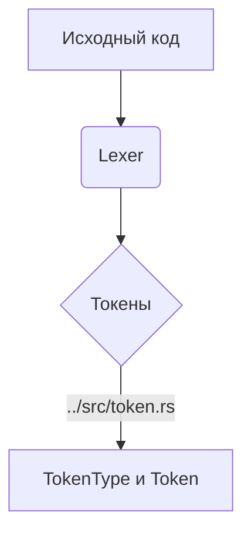

# Лексический анализатор (../src/lexer.rs)

Модуль [`../src/lexer.rs`](../src/lexer.rs) реализует лексический анализатор (лексер) для языка SOFIA. Лексер отвечает за преобразование входного потока символов (исходного кода) в последовательность токенов, которые затем используются синтаксическим анализатором (парсером).

## 💡 Структура модуля



## 📦 Структура `Lexer`

Структура [`Lexer`](../src/lexer.rs:4) хранит состояние лексического анализатора.

### Поля

- `input`: [`Vec<char>`](../src/lexer.rs:5) — Входной исходный код, представленный вектором символов.
- `position`: [`usize`](../src/lexer.rs:6) — Текущая позиция в `input`, указывающая на символ, который в данный момент анализируется.
- `read_position`: [`usize`](../src/lexer.rs:7) — Следующая позиция для чтения в `input` (символ после `ch`).
- `ch`: [`char`](../src/lexer.rs:8) — Текущий символ, который анализируется.

## 🛠️ Публичные методы

### `new`

```rust
pub fn new(input: String) -> Self
```

Создает новый экземпляр [`Lexer`](../src/lexer.rs:13) из заданной строки исходного кода. Инициализирует внутреннее состояние лексера и считывает первый символ.

- **Параметры:**

  - `input`: [`String`](../src/lexer.rs:13) — Строка, содержащая исходный код для анализа.

- **Возвращает:**
  - `Self` ([`Lexer`](../src/lexer.rs:13)) — Новый экземпляр лексера.

### `next_token`

```rust
pub fn next_token(&mut self) -> Token
```

Основной метод лексера, который считывает и возвращает следующий токен из входного потока. Этот метод пропускает пробелы и однострочные комментарии, а затем определяет тип токена на основе текущего символа и, при необходимости, следующего символа.

- **Возвращает:**
  - [`Token`](../src/token.rs:75) — Следующий распознанный токен.

## 🔒 Приватные вспомогательные методы

- `read_char(&mut self)`: Считывает следующий символ из входного потока и обновляет `position`, `read_position` и `ch`.
- `peek_char(&self) -> char`: "Подглядывает" следующий символ во входном потоке без изменения текущей позиции. Используется для определения многосимвольных операторов (например, `==`, `!=`, `**`, `&&`, `||`, `..`).
- `skip_whitespace(&mut self)`: Пропускает все пробельные символы до первого непробельного символа.
- `skip_comments(&mut self)`: Пропускает однострочные комментарии, начинающиеся с `//`.
- `is_comment_start(&self) -> bool`: Проверяет, начинается ли текущая позиция с `//`.
- `read_identifier(&mut self) -> String`: Считывает последовательность символов, формирующих идентификатор или ключевое слово.
- `read_number(&mut self) -> String`: Считывает последовательность символов, формирующих целочисленный литерал.
- `read_string(&mut self) -> Token`: Считывает строковый литерал, заключенный в кавычки.
- `is_letter(&self) -> bool`: Проверяет, является ли текущий символ буквой или подчеркиванием.
- `is_digit(&self) -> bool`: Проверяет, является ли текущий символ цифрой.
- `lookup_ident(ident: &str) -> TokenType`: Определяет, является ли считанный идентификатор ключевым словом языка SOFIA, и возвращает соответствующий [`TokenType`](../src/token.rs:3).

## 📝 Пример использования

```rust
use crate::lexer::Lexer;
use crate::token::{Token, TokenType};

let input = "let x = 10;".to_string();
let mut lexer = Lexer::new(input);

let token1 = lexer.next_token();
assert_eq!(token1.token_type, TokenType::Let);
assert_eq!(token1.literal, "let");

let token2 = lexer.next_token();
assert_eq!(token2.token_type, TokenType::Ident);
assert_eq!(token2.literal, "x");

let token3 = lexer.next_token();
assert_eq!(token3.token_type, TokenType::Assign);
assert_eq!(token3.literal, "=");

let token4 = lexer.next_token();
assert_eq!(token4.token_type, TokenType::Int);
assert_eq!(token4.literal, "10");

let token5 = lexer.next_token();
assert_eq!(token5.token_type, TokenType::Semicolon);
assert_eq!(token5.literal, ";");

let token6 = lexer.next_token();
assert_eq!(token6.token_type, TokenType::Eof);
assert_eq!(token6.literal, "");
```
