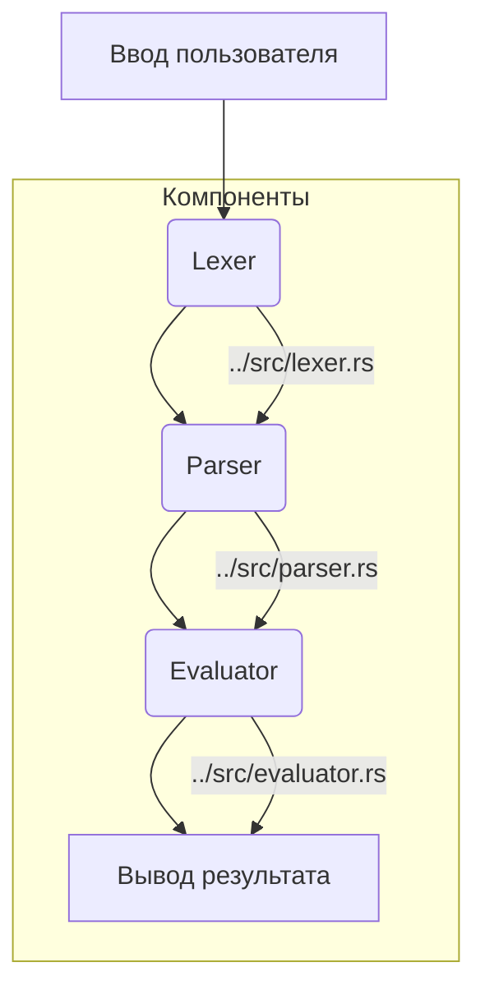

# Точка входа (../src/main.rs)

Модуль [`../src/main.rs`](../src/main.rs) является точкой входа для интерпретатора языка SOFIA. Он реализует простой цикл Read-Eval-Print Loop (REPL), который позволяет пользователям вводить код SOFIA и немедленно видеть результаты его выполнения.

## 💡 Структура модуля



## 🛠️ Функция `main`

```rust
fn main()
```

Функция [`main`](../src/main.rs:16) инициализирует среду выполнения и запускает REPL.

### Алгоритм работы

1.  **Инициализация среды:** Создается новая пустая среда выполнения ([`Environment`](../src/object.rs:155)), которая будет использоваться для хранения переменных и функций в течение сессии REPL.
2.  **Цикл REPL:**
    - **Read (Чтение):** Программа выводит приглашение `>> ` и ожидает ввода от пользователя. Введенная строка считывается.
    - **Eval (Вычисление):**
      - Введенная строка передается лексеру ([`Lexer::new`](../src/lexer.rs:13)) для преобразования в токены.
      - Токены передаются парсеру ([`Parser::new`](../src/parser.rs:39)) для построения Абстрактного Синтаксического Дерева (AST).
      - Если в процессе парсинга возникают ошибки, они выводятся, и цикл продолжается.
      - AST передается интерпретатору ([`evaluator::eval`](../src/evaluator.rs:13)) вместе с текущей средой выполнения для вычисления.
    - **Print (Печать):** Результат вычисления (объект [`Object`](../src/object.rs:8)) выводится на стандартный вывод.
    - **Loop (Цикл):** Процесс повторяется, пока пользователь не завершит ввод (например, с помощью Ctrl+D).

### Пример взаимодействия в REPL

```
>> let x = 10;
null
>> x * 2;
20
>> fn(a, b) { return a + b; }(5, 3);
8
>> class MyClass { public value = 100; }
null
>> let obj = new MyClass();
instance of MyClass
>> obj.value;
100
>> match 5 { 1..=4 => "small", 5..=10 => "medium", _ => "large" }
medium
>>
```
