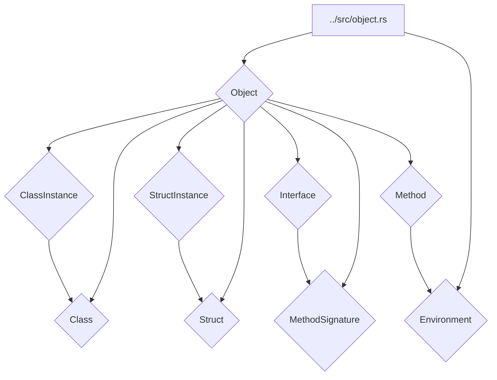

# Объектная модель (../src/object.rs)

Модуль [`../src/object.rs`](../src/object.rs) определяет внутреннее представление значений (объектов) языка SOFIA, а также среду выполнения (Environment) для хранения переменных. Эти структуры используются интерпретатором ([`../src/evaluator.rs`](../src/evaluator.rs)) для работы с данными во время выполнения программы.

## 💡 Структура модуля



## 🏷️ Перечисление `Object`

Перечисление [`Object`](../src/object.rs:8) является центральным типом в объектной модели SOFIA. Оно инкапсулирует все возможные типы значений, которые могут быть представлены и обработаны в языке.

### Варианты

- `Integer(i64)`: Целочисленное значение.
- `Boolean(bool)`: Булево значение (`true` или `false`).
- `Null`: Представляет отсутствие значения.
- `ReturnValue(Box<Object>)`: Обертка для значений, возвращаемых из функций, чтобы отличать их от обычных значений в блоках кода.
- `Error(String)`: Представляет ошибку выполнения.
- `Function(Vec<Identifier>, BlockStatement, Rc<RefCell<Environment>>)`: Представляет функцию, содержащую параметры, тело и замыкающую среду.
- `String(String)`: Строковое значение.
- `Array(Vec<Object>)`: Массив объектов.
- `Class(Rc<RefCell<Class>>)`: Обертка для определения класса.
- `ClassInstance(Rc<RefCell<ClassInstance>>)`: Обертка для экземпляра класса.
- `Struct(Rc<RefCell<Struct>>)`: Обертка для определения структуры.
- `StructInstance(Rc<RefCell<StructInstance>>)`: Обертка для экземпляра структуры.
- `Interface(Rc<RefCell<Interface>>)`: Обертка для определения интерфейса.
- `Method(Rc<RefCell<Method>>)`: Обертка для метода класса, связанного с экземпляром.

### Метод `type_str`

```rust
pub fn type_str(&self) -> &str
```

Возвращает строковое представление типа объекта.

- **Возвращает:**
  - `&str` — Строка, представляющая тип объекта (например, "INTEGER", "BOOLEAN", "CLASS_INSTANCE").

## 📦 Структуры

### `Class`

Структура [`Class`](../src/object.rs:107) представляет определение класса в языке SOFIA.

### Поля

- `name`: [`String`](../src/object.rs:108) — Имя класса.
- `super_class`: [`Option<Rc<RefCell<Class>>>`](../src/object.rs:109) — Опциональная ссылка на родительский класс, если класс наследуется.
- `interfaces`: [`Vec<Rc<RefCell<Interface>>>`](../src/object.rs:110) — Вектор ссылок на интерфейсы, которые реализует класс.
- `properties`: [`HashMap<String, Object>`](../src/object.rs:111) — Карта свойств класса, где ключ — имя свойства, значение — его объект.
- `methods`: [`HashMap<String, Rc<RefCell<Method>>>`](../src/object.rs:112) — Карта методов класса, где ключ — имя метода, значение — его определение.

### `ClassInstance`

Структура [`ClassInstance`](../src/object.rs:116) представляет экземпляр класса.

### Поля

- `class`: [`Rc<RefCell<Class>>`](../src/object.rs:117) — Ссылка на определение класса, к которому принадлежит этот экземпляр.
- `fields`: [`HashMap<String, Object>`](../src/object.rs:118) — Карта полей экземпляра, где ключ — имя поля, значение — его объект.

### `Struct`

Структура [`Struct`](../src/object.rs:122) представляет определение структуры в языке SOFIA.

### Поля

- `name`: [`String`](../src/object.rs:123) — Имя структуры.
- `properties`: [`HashMap<String, Object>`](../src/object.rs:124) — Карта свойств структуры, где ключ — имя свойства, значение — его объект.

### `StructInstance`

Структура [`StructInstance`](../src/object.rs:128) представляет экземпляр структуры.

### Поля

- `struct_def`: [`Rc<RefCell<Struct>>`](../src/object.rs:129) — Ссылка на определение структуры, к которой принадлежит этот экземпляр.
- `fields`: [`HashMap<String, Object>`](../src/object.rs:130) — Карта полей экземпляра структуры, где ключ — имя поля, значение — его объект.

### `Interface`

Структура [`Interface`](../src/object.rs:134) представляет определение интерфейса в языке SOFIA.

### Поля

- `name`: [`String`](../src/object.rs:135) — Имя интерфейса.
- `method_signatures`: [`HashMap<String, MethodSignature>`](../src/object.rs:136) — Карта сигнатур методов интерфейса, где ключ — имя метода, значение — его сигнатура.

### `Method`

Структура [`Method`](../src/object.rs:140) представляет метод класса.

### Поля

- `name`: [`String`](../src/object.rs:141) — Имя метода.
- `parameters`: [`Vec<Identifier>`](../src/object.rs:142) — Вектор идентификаторов параметров метода.
- `body`: [`BlockStatement`](../src/object.rs:143) — Тело метода.
- `env`: [`Rc<RefCell<Environment>>`](../src/object.rs:144) — Замыкающая среда, в которой был определен метод.
- `this`: [`Option<Rc<RefCell<ClassInstance>>>`](../src/object.rs:145) — Опциональная ссылка на экземпляр класса, к которому привязан метод (для `this`).

### `MethodSignature`

Структура [`MethodSignature`](../src/object.rs:149) представляет сигнатуру метода, используемую в интерфейсах.

### Поля

- `name`: [`String`](../src/object.rs:150) — Имя метода.
- `parameters`: [`Vec<Identifier>`](../src/object.rs:151) — Вектор идентификаторов параметров метода.

### `Environment`

Структура [`Environment`](../src/object.rs:155) представляет среду выполнения, которая хранит переменные и их значения.

### Поля

- `store`: [`HashMap<String, Object>`](../src/object.rs:156) — Карта, хранящая переменные (имя -> значение).
- `outer`: [`Option<Rc<RefCell<Environment>>>`](../src/object.rs:157) — Опциональная ссылка на внешнюю (родительскую) среду, реализующая лексическое замыкание.

### Методы

- `new() -> Self`: Создает новую пустую среду.
- `new_enclosed(outer: Rc<RefCell<Environment>>) -> Self`: Создает новую среду, вложенную в другую среду.
- `get(&self, name: &str) -> Option<Object>`: Получает значение переменной по имени, сначала ища в текущей среде, затем во внешних.
- `set(&mut self, name: String, val: Object)`: Устанавливает значение переменной в текущей среде.

## 📝 Примеры использования

```rust
use crate::object::{Environment, Object};
use std::cell::RefCell;
use std::rc::Rc;

let mut env = Environment::new();
env.set("x".to_string(), Object::Integer(10));

let val_x = env.get("x").unwrap();
assert_eq!(val_x, Object::Integer(10));

let enclosed_env = Environment::new_enclosed(Rc::new(RefCell::new(env)));
enclosed_env.borrow_mut().set("y".to_string(), Object::Boolean(true));

let val_y = enclosed_env.borrow().get("y").unwrap();
assert_eq!(val_y, Object::Boolean(true));

// Доступ к переменной из внешней среды
let val_x_from_enclosed = enclosed_env.borrow().get("x").unwrap();
assert_eq!(val_x_from_enclosed, Object::Integer(10));
```
