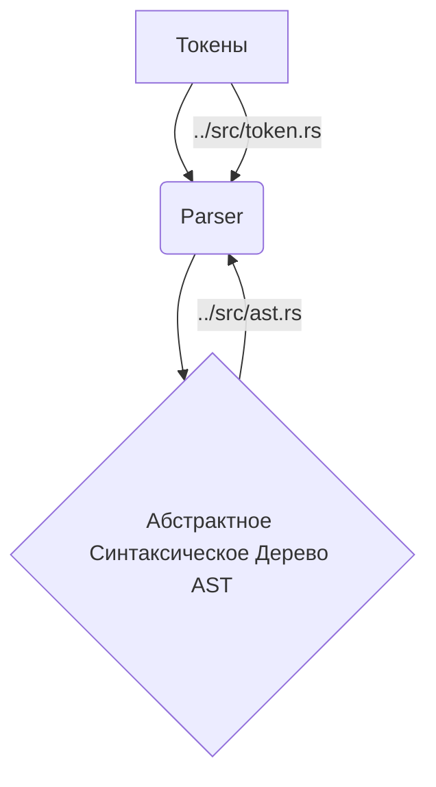

# Синтаксический анализатор (../src/parser.rs)

Модуль [`../src/parser.rs`](../src/parser.rs) реализует синтаксический анализатор (парсер) для языка SOFIA. Парсер принимает на вход последовательность токенов, сгенерированных лексером, и строит Абстрактное Синтаксическое Дерево (AST), которое является иерархическим представлением исходного кода. Парсер использует алгоритм "Pratt parser" для обработки выражений с учетом приоритетов операторов.

## 💡 Структура модуля



## 🏷️ Перечисления

### `Precedence`

Перечисление [`Precedence`](../src/parser.rs:7) определяет приоритеты операторов в языке SOFIA. Чем выше значение, тем выше приоритет. Это критически важно для корректного построения AST выражений.

- `Lowest`: Самый низкий приоритет.
- `Arrow`: Приоритет для оператора `=>` в `match` выражениях.
- `Or`: Приоритет для логического оператора `||`.
- `And`: Приоритет для логического оператора `&&`.
- `Equals`: Приоритет для операторов сравнения `==`, `!=`.
- `LessGreater`: Приоритет для операторов сравнения `<`, `>`.
- `Sum`: Приоритет для операторов сложения и вычитания `+`, `-`.
- `Product`: Приоритет для операторов умножения, деления и модуля `*`, `/`, `%`.
- `Power`: Приоритет для оператора возведения в степень `**`.
- `Range`: Приоритет для операторов диапазона `..`, `..=`.
- `Prefix`: Приоритет для префиксных операторов `-X`, `!X`.
- `Call`: Приоритет для вызова функций `myFunction(X)`.
- `Dot`: Приоритет для доступа к членам объекта `object.member`.

### `ParserError`

Перечисление [`ParserError`](../src/parser.rs:25) определяет типы ошибок, которые могут возникнуть в процессе синтаксического анализа.

- `UnexpectedToken(String)`: Возникает, когда парсер ожидает определенный токен, но получает другой.

## 📦 Структура `Parser`

Структура [`Parser`](../src/parser.rs:30) хранит состояние синтаксического анализатора.

### Поля

- `lexer`: [`Lexer`](../src/parser.rs:31) — Экземпляр лексера, используемый для получения токенов.
- `current_token`: [`Token`](../src/parser.rs:32) — Текущий токен, который анализируется.
- `next_token`: [`Token`](../src/parser.rs:33) — Следующий токен (для "подглядывания" вперед).
- `errors`: [`Vec<ParserError>`](../src/parser.rs:34) — Вектор ошибок, обнаруженных в процессе парсинга.

## 🛠️ Публичные методы

### `new`

```rust
pub fn new(lexer: Lexer) -> Self
```

Создает новый экземпляр [`Parser`](../src/parser.rs:39). Инициализирует лексер и считывает первые два токена для заполнения `current_token` и `next_token`.

- **Параметры:**

  - `lexer`: [`Lexer`](../src/parser.rs:39) — Инициализированный лексер.

- **Возвращает:**
  - `Self` ([`Parser`](../src/parser.rs:39)) — Новый экземпляр парсера.

### `parse_program`

```rust
pub fn parse_program(&mut self) -> Result<Program, Vec<ParserError>>
```

Основной метод парсера, который запускает процесс синтаксического анализа всей программы. Он итерируется по токенам, парсит операторы и собирает их в структуру [`Program`](../src/ast.rs:22).

- **Возвращает:**
  - [`Result<Program, Vec<ParserError>>`](../src/parser.rs:61) — `Ok(Program)` в случае успешного парсинга или `Err(Vec<ParserError>)` при наличии ошибок.

## 🔒 Приватные вспомогательные методы (ключевые)

- `next_token(&mut self)`: Сдвигает токены, делая `next_token` текущим, а новый токен от лексера — следующим.
- `parse_statement(&mut self) -> Result<ast::Statement, ParserError>`: Определяет тип оператора на основе `current_token` и вызывает соответствующую функцию парсинга.
- `parse_let_statement(&mut self) -> Result<ast::Statement, ParserError>`: Парсит оператор объявления переменной (`let`).
- `parse_return_statement(&mut self) -> Result<ast::Statement, ParserError>`: Парсит оператор возврата (`return`).
- `parse_expression_statement(&mut self) -> Result<ast::Statement, ParserError>`: Парсит оператор, состоящий из одного выражения.
- `parse_expression(&mut self, precedence: Precedence) -> Result<ast::Expression, ParserError>`: Реализует алгоритм "Pratt parser" для парсинга выражений с учетом приоритетов.
- `parse_prefix(&mut self) -> Result<ast::Expression, ParserError>`: Парсит префиксные выражения (например, идентификаторы, литералы, унарные операторы).
- `parse_infix(&mut self, left: ast::Expression) -> Result<ast::Expression, ParserError>`: Парсит инфиксные выражения (например, бинарные операторы, вызовы функций, доступ к свойствам).
- `parse_integer_literal(&mut self) -> Result<ast::Expression, ParserError>`: Парсит целочисленные литералы.
- `parse_string_literal(&mut self) -> Result<ast::Expression, ParserError>`: Парсит строковые литералы.
- `parse_prefix_expression(&mut self) -> Result<ast::Expression, ParserError>`: Парсит префиксные операторы (`!`, `-`).
- `parse_infix_expression(&mut self, left: ast::Expression) -> Result<ast::Expression, ParserError>`: Парсит инфиксные операторы (`+`, `-`, `*`, `/`, `==`, `!=`, `<`, `>`, `**`, `&&`, `||`, `%`).
- `parse_boolean(&mut self) -> Result<ast::Expression, ParserError>`: Парсит булевы литералы (`true`, `false`).
- `parse_grouped_expression(&mut self) -> Result<ast::Expression, ParserError>`: Парсит выражения в круглых скобках.
- `parse_array_literal(&mut self) -> Result<ast::Expression, ParserError>`: Парсит литералы массивов.
- `parse_block_statement(&mut self) -> Result<ast::BlockStatement, ParserError>`: Парсит блок операторов `{ ... }`.
- `parse_if_expression(&mut self) -> Result<ast::Expression, ParserError>`: Парсит условное выражение `if-else`.
- `parse_function_literal(&mut self) -> Result<ast::Expression, ParserError>`: Парсит литерал функции `fn(params) { body }`.
- `parse_function_parameters(&mut self) -> Result<Vec<ast::Identifier>, ParserError>`: Парсит список параметров функции.
- `parse_call_expression(&mut self, function: ast::Expression) -> Result<ast::Expression, ParserError>`: Парсит вызов функции.
- `parse_expression_list(&mut self, end: TokenType) -> Result<Vec<ast::Expression>, ParserError>`: Вспомогательная функция для парсинга списков выражений (например, аргументов функции, элементов массива).
- `parse_property_access_expression(&mut self, left: ast::Expression) -> Result<ast::Expression, ParserError>`: Парсит доступ к свойству объекта `obj.property`.
- `parse_new_expression(&mut self) -> Result<ast::Expression, ParserError>`: Парсит выражение создания нового экземпляра `new Class()`.
- `parse_this_expression(&mut self) -> Result<ast::Expression, ParserError>`: Парсит выражение `this`.
- `parse_super_expression(&mut self) -> Result<ast::Expression, ParserError>`: Парсит выражение `super`.
- `parse_match_expression(&mut self) -> Result<ast::Expression, ParserError>`: Парсит выражение сопоставления с образцом `match`.
- `parse_class_declaration(&mut self) -> Result<ast::Statement, ParserError>`: Парсит объявление класса.
- `parse_struct_declaration(&mut self) -> Result<ast::Statement, ParserError>`: Парсит объявление структуры.
- `parse_interface_declaration(&mut self) -> Result<ast::Statement, ParserError>`: Парсит объявление интерфейса.
- `parse_access_modifier_and_static(&mut self) -> (AccessModifier, bool)`: Парсит модификаторы доступа (`public`, `private`) и `static`.
- `parse_property_declaration(&mut self, access_modifier: AccessModifier, is_static: bool) -> Result<ast::PropertyDeclaration, ParserError>`: Парсит объявление свойства с ключевым словом `let`.
- `parse_method_declaration(&mut self, access_modifier: AccessModifier, is_static: bool) -> Result<ast::MethodDeclaration, ParserError>`: Парсит объявление метода с ключевым словом `fn`.
- `parse_method_declaration_without_fn(&mut self, access_modifier: AccessModifier, is_static: bool) -> Result<ast::MethodDeclaration, ParserError>`: Парсит объявление метода без ключевого слова `fn`.
- `parse_property_declaration_without_let(&mut self, access_modifier: AccessModifier, is_static: bool) -> Result<ast::PropertyDeclaration, ParserError>`: Парсит объявление свойства без ключевого слова `let`.
- `parse_method_signature_declaration(&mut self) -> Result<ast::MethodSignatureDeclaration, ParserError>`: Парсит сигнатуру метода в интерфейсе.
- `parse_pattern(&mut self) -> Result<ast::Pattern, ParserError>`: Парсит различные типы паттернов для `match` выражений.
- `parse_range_pattern(&mut self, start_expr: ast::Expression) -> Result<ast::Pattern, ParserError>`: Парсит диапазонные паттерны.
- `parse_struct_pattern(&mut self, name: ast::Identifier) -> Result<ast::Pattern, ParserError>`: Парсит структурные паттерны.
- `parse_match_arm(&mut self) -> Result<ast::MatchArm, ParserError>`: Парсит одну ветвь `match` выражения, включая паттерн, опциональный гард и тело.

## 📝 Примеры использования

```rust
use crate::lexer::Lexer;
use crate::parser::Parser;
use crate::ast::{Program, Statement, Expression, Identifier, IntegerLiteral, InfixExpression, BlockStatement, IfExpression};
use crate::token::{Token, TokenType};

let input = "let x = 5 + 10;".to_string();
let lexer = Lexer::new(input);
let mut parser = Parser::new(lexer);

let program = parser.parse_program().unwrap();

// Ожидаем один оператор Let
assert_eq!(program.statements.len(), 1);

if let Statement::Let(let_stmt) = &program.statements[0] {
    assert_eq!(let_stmt.name.value, "x");
    if let Expression::Infix(infix_exp) = &let_stmt.value {
        if let Expression::IntegerLiteral(left_val) = &*infix_exp.left {
            assert_eq!(left_val.value, 5);
        }
        assert_eq!(infix_exp.operator, "+");
        if let Expression::IntegerLiteral(right_val) = &*infix_exp.right {
            assert_eq!(right_val.value, 10);
        }
    }
}

let input_if = "if (x < y) { return x; } else { return y; }".to_string();
let lexer_if = Lexer::new(input_if);
let mut parser_if = Parser::new(lexer_if);
let program_if = parser_if.parse_program().unwrap();

if let Statement::Expression(expr_stmt) = &program_if.statements[0] {
    if let Expression::If(if_expr) = &expr_stmt.expression {
        assert_eq!(if_expr.condition.to_string(), "(x < y)");
        assert_eq!(if_expr.consequence.statements.len(), 1);
        assert!(if_expr.alternative.is_some());
    }
}
```
