# Синтаксис языка SOFIA

Данный документ описывает синтаксис языка программирования SOFIA, включая его основные конструкции: операторы, выражения, объявления и паттерны. Понимание синтаксиса является фундаментальным для написания корректного и функционального кода на SOFIA.

## 💡 Обзор синтаксиса

Язык SOFIA поддерживает различные синтаксические конструкции, которые позволяют определять переменные, выполнять операции, управлять потоком выполнения, объявлять функции, классы, структуры, интерфейсы и использовать мощные механизмы сопоставления с образцом.

## 📝 Операторы (Statements)

Операторы выполняют действия и не возвращают значений.

### Объявление переменной (`let`)

Оператор `let` используется для объявления и инициализации переменных.

```rust
let переменная = значение;
```

- `переменная`: Имя переменной.
- `значение`: Выражение, результат которого присваивается переменной.

**Пример:**

```rust
let x = 10;
let greeting = "Привет, мир!";
```

### Оператор возврата (`return`)

Оператор `return` используется для выхода из функции и возврата значения.

```rust
return выражение;
```

- `выражение`: Значение, которое будет возвращено функцией.

**Пример:**

```rust
fn add(a, b) {
    return a + b;
}
```

### Выражение как оператор

Любое выражение может быть использовано как оператор, если оно завершается точкой с запятой.

**Пример:**

```rust
5 + 3;
"hello" + " world";
```

### Блок операторов (`BlockStatement`)

Блок операторов — это последовательность операторов, заключенных в фигурные скобки `{}`.

```rust
{
    оператор1;
    оператор2;
    // ...
}
```

**Пример:**

```rust
if (x > 0) {
    let y = x * 2;
    return y;
}
```

### Объявление класса (`class`)

Объявление класса используется для создания новых типов данных, которые могут содержать свойства и методы.

```rust
class ИмяКласса [extends РодительскийКласс] [implements Интерфейс1, Интерфейс2] {
    [модификатор] [static] let свойство [= значение];
    [модификатор] [static] fn метод(параметры) { тело_метода }
}
```

- `ИмяКласса`: Имя нового класса.
- `extends РодительскийКласс`: Опционально, указывает на наследование от другого класса.
- `implements Интерфейс1, Интерфейс2`: Опционально, указывает на реализацию одного или нескольких интерфейсов.
- `модификатор`: `public` или `private`.
- `static`: Опционально, делает свойство или метод статическим.

**Пример:**

```rust
class Animal {
    public fn speak() {
        return "animal sound";
    }
}

class Dog extends Animal {
    public let breed = "Labrador";
    public fn speak() {
        return "woof";
    }
}
```

### Объявление структуры (`struct`)

Объявление структуры используется для создания пользовательских типов данных, которые группируют связанные свойства.

```rust
struct ИмяСтруктуры {
    [модификатор] [static] let свойство [= значение];
}
```

- `ИмяСтруктуры`: Имя новой структуры.
- `модификатор`: `public` или `private`.
- `static`: Опционально, делает свойство статическим.

**Пример:**

```rust
struct Point {
    public let x = 0;
    public let y = 0;
}
```

### Объявление интерфейса (`interface`)

Объявление интерфейса определяет набор сигнатур методов, которые должны быть реализованы классами.

```rust
interface ИмяИнтерфейса {
    fn имяМетода(параметры);
}
```

- `ИмяИнтерфейса`: Имя нового интерфейса.

**Пример:**

```rust
interface Speaker {
    fn speak();
}
```

## ⚡ Выражения (Expressions)

Выражения вычисляются и возвращают значение.

### Идентификаторы (`Identifier`)

Идентификаторы используются для ссылки на переменные, функции, классы и другие именованные сущности.

**Пример:**

```rust
x;
myFunction;
```

### Литералы

- **Целочисленные литералы (`IntegerLiteral`):** Целые числа.
  **Пример:** `10`, `-5`, `0`
- **Булевы литералы (`BooleanLiteral`):** Логические значения `true` и `false`.
  **Пример:** `true`, `false`
- **Строковые литералы (`StringLiteral`):** Последовательности символов, заключенные в двойные кавычки.
  **Пример:** `"hello"`, `"SOFIA"`
- **Литералы массивов (`ArrayLiteral`):** Список выражений, заключенных в квадратные скобки.
  **Пример:** `[1, 2, 3]`, `["a", "b"]`
- **Литералы функций (`FunctionLiteral`):** Анонимные функции.
  ```rust
  fn(параметр1, параметр2) { тело_функции }
  ```
  **Пример:**
  ```rust
  let add = fn(a, b) { return a + b; };
  ```

### Префиксные выражения (`PrefixExpression`)

Оператор, стоящий перед выражением.

```rust
оператор выражение
```

- `оператор`: `!` (логическое отрицание), `-` (унарный минус).

**Пример:**

```rust
!true;
-10;
```

### Инфиксные выражения (`InfixExpression`)

Оператор, стоящий между двумя выражениями.

```rust
выражение1 оператор выражение2
```

- `оператор`: `+`, `-`, `*`, `/`, `**` (степень), `%` (модуль), `<`, `>`, `==`, `!=`, `&&` (логическое И), `||` (логическое ИЛИ).

**Пример:**

```rust
10 + 5;
x == y;
true && false;
"hello" + " world";
"abc" * 3; // "abcabcabc"
```

### Условное выражение (`if`)

Выполняет один блок кода, если условие истинно, и опционально другой блок, если ложно.

```rust
if (условие) {
    блок_истина
} [else {
    блок_ложь
}]
```

**Пример:**

```rust
let result = if (x > 0) { "положительное" } else { "отрицательное или ноль" };
```

### Вызов функции (`CallExpression`)

Вызывает функцию с заданными аргументами.

```rust
функция(аргумент1, аргумент2, ...)
```

- `функция`: Выражение, которое вычисляется в функцию.
- `аргумент`: Выражения, передаваемые в функцию.

**Пример:**

```rust
add(5, 3);
myObject.method(arg1);
```

### Создание нового экземпляра (`new`)

Создает новый экземпляр класса или структуры.

```rust
new ИмяТипа(аргумент1, аргумент2, ...)
```

- `ИмяТипа`: Идентификатор класса или структуры.
- `аргумент`: Аргументы, передаваемые конструктору (если применимо).

**Пример:**

```rust
let p = new Point(1, 2);
let dog = new Dog();
```

### Выражение `this`

Ссылка на текущий экземпляр класса внутри методов.

**Пример:**

```rust
class MyClass {
    public value = 10;
    public getValue() {
        return this.value;
    }
}
```

### Выражение `super`

Ссылка на родительский класс, используется для вызова методов родителя.

**Пример:**

```rust
class Child extends Parent {
    public fn getParentValue() {
        return super.getValue();
    }
}
```

### Доступ к свойству (`PropertyAccessExpression`)

Доступ к свойству объекта или структуры.

```rust
объект.свойство
```

- `объект`: Выражение, которое вычисляется в объект или структуру.
- `свойство`: Идентификатор имени свойства.

**Пример:**

```rust
myObject.name;
point.x;
```

### Вызов метода (`MethodCallExpression`)

Вызов метода объекта.

```rust
объект.метод(аргумент1, аргумент2, ...)
```

- `объект`: Выражение, которое вычисляется в объект.
- `метод`: Идентификатор имени метода.
- `аргумент`: Аргументы, передаваемые методу.

**Пример:**

```rust
myObject.doSomething(1, 2);
```

### Выражение сопоставления с образцом (`match`)

Выражение `match` позволяет сопоставлять значение с различными паттернами и выполнять соответствующий блок кода.

```rust
match значение {
    паттерн1 [if гард1] => блок_кода1,
    паттерн2 [if гард2] => блок_кода2,
    // ...
}
```

- `значение`: Выражение, результат которого будет сопоставляться.
- `паттерн`: Один из типов паттернов (литерал, идентификатор, диапазон, кортеж, структура, wildcard).
- `гард`: Опциональное булево выражение, которое должно быть истинным для срабатывания ветви.
- `блок_кода`: Выражение, которое будет выполнено при совпадении паттерна и истинном гарде.

**Пример:**

```rust
let x = 5;
let description = match x {
    1 => "один",
    2..=4 => "от двух до четырех",
    n if n > 10 => "больше десяти",
    _ => "другое число",
};
// description будет "другое число"
```

## 🧩 Паттерны (Patterns)

Паттерны используются в `match` выражениях для деструктуризации и сопоставления значений.

### Литеральный паттерн (`Literal`)

Сопоставляет значение с конкретным литералом.

**Пример:**

```rust
match x {
    1 => "единица",
    "hello" => "приветствие",
    true => "истина",
}
```

### Идентификаторный паттерн (`Identifier`)

Привязывает сопоставляемое значение к новой переменной.

**Пример:**

```rust
match x {
    n => n * 2, // n будет равно значению x
}
```

### Паттерн-заглушка (`Wildcard`)

Совпадает с любым значением, но не создает привязок. Используется для обработки всех остальных случаев.

**Пример:**

```rust
match x {
    1 => "один",
    _ => "что-то другое",
}
```

### Диапазонный паттерн (`RangePattern`)

Сопоставляет целочисленное значение с диапазоном.

```rust
начало..конец    // исключая конец
начало..=конец   // включая конец
```

**Пример:**

```rust
match age {
    0..12 => "ребенок",
    13..17 => "подросток",
    18..=65 => "взрослый",
    _ => "пожилой",
}
```

### Кортежный паттерн (`TuplePattern`)

Сопоставляет значение с массивом (кортежем) и может деструктурировать его элементы.

```rust
[паттерн1, паттерн2, ...]
```

**Пример:**

```rust
let point = [10, 20];
match point {
    [x, y] => x + y, // x = 10, y = 20
    _ => 0,
}
```

### Структурный паттерн (`StructPattern`)

Сопоставляет значение с экземпляром структуры и может деструктурировать её поля.

```rust
ИмяСтруктуры { поле1: паттерн1, поле2, ... }
```

- `ИмяСтруктуры`: Имя структуры.
- `поле1: паттерн1`: Сопоставляет значение поля `поле1` с `паттерн1`.
- `поле2`: Сокращенная запись, эквивалентная `поле2: поле2`, привязывает значение поля `поле2` к переменной `поле2`.

**Пример:**

```rust
struct Point { public let x; public let y; }
let p = new Point(1, 2);
match p {
    Point { x: 0, y } => y, // если x == 0, y привязывается к значению поля y
    Point { x, y: 10 } => x, // если y == 10, x привязывается к значению поля x
    _ => -1,
}
```

## 📊 Диаграмма синтаксических элементов

```mermaid
graph TD
    A[Программа] --> B[Операторы];
    A --> C[Выражения];
    B --> B1[Объявление переменной let];
    B --> B2[Оператор return];
    B --> B3[Выражение как оператор];
    B --> B4[Блок операторов];
    B --> B5[Объявление класса class];
    B --> B6[Объявление структуры struct];
    B --> B7[Объявление интерфейса interface];

    C --> C1[Идентификаторы];
    C --> C2[Литералы];
    C --> C3[Префиксные выражения];
    C --> C4[Инфиксные выражения];
    C --> C5[Условное выражение if];
    C --> C6[Вызов функции];
    C --> C7[Создание нового экземпляра new];
    C --> C8[Выражение this];
    C --> C9[Выражение super];
    C --> C10[Доступ к свойству];
    C --> C11[Вызов метода];
    C --> C12[Выражение match];

    C2 --> C2a[Целочисленные];
    C2 --> C2b[Булевы];
    C2 --> C2c[Строковые];
    C2 --> C2d[Массивы];
    C2 --> C2e[Функции];

    C12 --> P[Паттерны];
    P --> P1[Литеральный паттерн];
    P --> P2[Идентификаторный паттерн];
    P --> P3[Паттерн-заглушка _];
    P --> P4[Диапазонный паттерн];
    P --> P5[Кортежный паттерн];
    P --> P6[Структурный паттерн];
```


