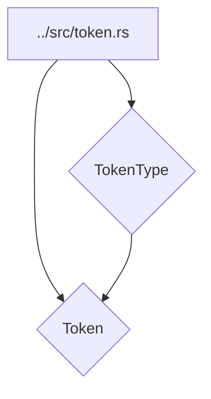

# Лексические токены (../src/token.rs)

Модуль [`../src/token.rs`](../src/token.rs) определяет базовые лексические единицы (токены), которые используются лексером для представления элементов исходного кода языка SOFIA. Каждый токен состоит из типа (`TokenType`) и строкового литерала.

## 💡 Структура модуля



## 🏷️ Перечисление `TokenType`

Перечисление [`TokenType`](../src/token.rs:3) определяет все возможные типы токенов, которые могут быть распознаны в языке SOFIA. Эти типы категоризированы для удобства:

- **Нераспознанные токены:**

  - [`Illegal`](../src/token.rs:5): Представляет собой символ или последовательность символов, которые не соответствуют ни одному из определённых типов токенов.
  - [`Eof`](../src/token.rs:7): Обозначает конец входного потока (конец файла).

- **Идентификаторы и литералы:**

  - [`Ident`](../src/token.rs:10): Идентификаторы, такие как имена переменных, функций, классов.
  - [`Int`](../src/token.rs:11): Целочисленные литералы.
  - [`String`](../src/token.rs:12): Строковые литералы.

- **Операторы:**

  - [`Assign`](../src/token.rs:15): Оператор присваивания (`=`).
  - [`Plus`](../src/token.rs:16): Оператор сложения (`+`).
  - [`Minus`](../src/token.rs:17): Оператор вычитания (`-`).
  - [`Bang`](../src/token.rs:18): Оператор логического отрицания (`!`).
  - [`Asterisk`](../src/token.rs:19): Оператор умножения (`*`).
  - [`Slash`](../src/token.rs:20): Оператор деления (`/`).
  - [`Lt`](../src/token.rs:21): Оператор "меньше чем" (`<`).
  - [`Gt`](../src/token.rs:22): Оператор "больше чем" (`>`).
  - [`Eq`](../src/token.rs:23): Оператор равенства (`==`).
  - [`NotEq`](../src/token.rs:24): Оператор неравенства (`!=`).
  - [`Power`](../src/token.rs:25): Оператор возведения в степень (`**`).
  - [`And`](../src/token.rs:26): Логический оператор И (`&&`).
  - [`Or`](../src/token.rs:27): Логический оператор ИЛИ (`||`).
  - [`Modulo`](../src/token.rs:28): Оператор взятия остатка от деления (`%`).

- **Разделители:**

  - [`Comma`](../src/token.rs:31): Запятая (`,`).
  - [`Semicolon`](../src/token.rs:32): Точка с запятой (`;`).
  - [`LParen`](../src/token.rs:33): Открывающая круглая скобка (`(`).
  - [`RParen`](../src/token.rs:34): Закрывающая круглая скобка (`)`).
  - [`LBrace`](../src/token.rs:35): Открывающая фигурная скобка (`{`).
  - [`RBrace`](../src/token.rs:36): Закрывающая фигурная скобка (`}`).
  - [`LBracket`](../src/token.rs:37): Открывающая квадратная скобка (`[`).
  - [`RBracket`](../src/token.rs:38): Закрывающая квадратная скобка (`]`).
  - [`Dot`](../src/token.rs:39): Точка (`.`).
  - [`Colon`](../src/token.rs:40): Двоеточие (`:`).
  - [`Underscore`](../src/token.rs:41): Подчеркивание (`_`).

- **Ключевые слова:**

  - [`Function`](../src/token.rs:44): Ключевое слово `fn` для объявления функций.
  - [`Let`](../src/token.rs:45): Ключевое слово `let` для объявления переменных.
  - [`True`](../src/token.rs:46): Булево значение `true`.
  - [`False`](../src/token.rs:47): Булево значение `false`.
  - [`If`](../src/token.rs:48): Ключевое слово `if` для условных выражений.
  - [`Else`](../src/token.rs:49): Ключевое слово `else` для условных выражений.
  - [`Return`](../src/token.rs:50): Ключевое слово `return` для возврата значений из функций.

- **Ключевые слова для сопоставления с образцом:**

  - [`Match`](../src/token.rs:53): Ключевое слово `match` для выражений сопоставления с образцом.
  - [`Arrow`](../src/token.rs:56): Оператор стрелки (`=>`) в выражениях `match`.
  - [`Range`](../src/token.rs:57): Оператор диапазона (`..` или `..=`) в паттернах `match`.

- **ООП ключевые слова:**
  - [`Class`](../src/token.rs:60): Ключевое слово `class` для объявления классов.
  - [`Interface`](../src/token.rs:61): Ключевое слово `interface` для объявления интерфейсов.
  - [`Struct`](../src/token.rs:62): Ключевое слово `struct` для объявления структур.
  - [`This`](../src/token.rs:63): Ключевое слово `this` для ссылки на текущий экземпляр.
  - [`Super`](../src/token.rs:64): Ключевое слово `super` для ссылки на родительский класс.
  - [`New`](../src/token.rs:65): Ключевое слово `new` для создания новых экземпляров.
  - [`Extends`](../src/token.rs:66): Ключевое слово `extends` для наследования классов.
  - [`Implements`](../src/token.rs:67): Ключевое слово `implements` для реализации интерфейсов.
  - [`Public`](../src/token.rs:68): Модификатор доступа `public`.
  - [`Private`](../src/token.rs:69): Модификатор доступа `private`.
  - [`Static`](../src/token.rs:70): Модификатор `static` для статических членов.

## 📦 Структура `Token`

Структура [`Token`](../src/token.rs:75) представляет собой конкретную лексическую единицу, найденную лексером.

### Поля

- `token_type`: [`TokenType`](../src/token.rs:76) — Тип токена, определяющий его категорию (например, `Ident`, `Int`, `Plus`).
- `literal`: [`String`](../src/token.rs:77) — Строковое представление токена, как он появился в исходном коде (например, "foobar", "123", "+").

### Метод `new`

```rust
pub fn new(token_type: TokenType, literal: String) -> Self
```

Создает новый экземпляр [`Token`](../src/token.rs:83).

- **Параметры:**

  - `token_type`: [`TokenType`](../src/token.rs:83) — Тип создаваемого токена.
  - `literal`: [`String`](../src/token.rs:83) — Строковое значение токена.

- **Возвращает:**
  - `Self` ([`Token`](../src/token.rs:83)) — Новый экземпляр токена.

### Пример использования

```rust
use crate::token::{Token, TokenType};

let ident_token = Token::new(TokenType::Ident, "myVariable".to_string());
let int_token = Token::new(TokenType::Int, "123".to_string());
let plus_token = Token::new(TokenType::Plus, "+".to_string());

assert_eq!(ident_token.token_type, TokenType::Ident);
assert_eq!(ident_token.literal, "myVariable");

assert_eq!(int_token.token_type, TokenType::Int);
assert_eq!(int_token.literal, "123");

assert_eq!(plus_token.token_type, TokenType::Plus);
assert_eq!(plus_token.literal, "+");
```
